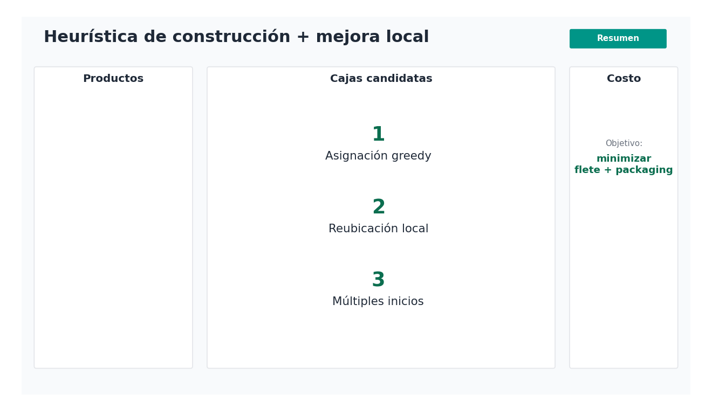
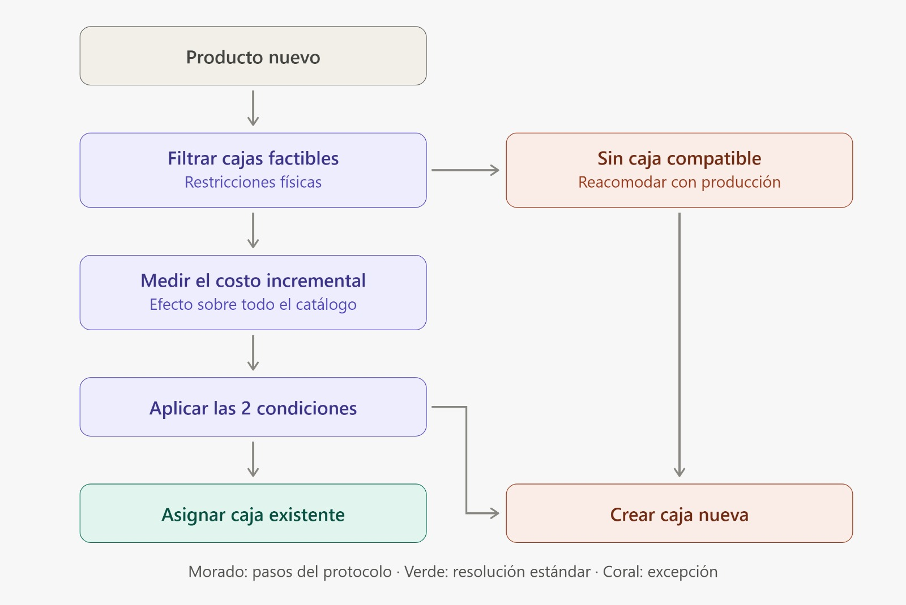

<style>
h1.title {
  position: relative;
  overflow: visible;
}

h1.title::before {
  content: "";
  position: absolute;
  left: 35%;
  transform: translateX(-50%);

  width: 840px;
  height: 180px;

  bottom: calc(100% - 70px);

  background-image: url("img/alix.png");
  background-repeat: no-repeat;
  background-position: center;
  background-size: contain;
}
</style>

```{r setup, include=FALSE}
knitr::opts_chunk$set(
  echo = FALSE,
  warning = FALSE,
  message = FALSE
)
```

# Introducción {#introduccion} 

Bonsai Corp es una empresa de brócoli congelado, en donde los productos se comercializan en un envase primario que contiene al alimento, y estos son colocados en cajas de cartón (envase secundario) para almacenarlos y transportarlos desde 5 plantas hacia 5 regiones distribuidas por el mundo. Esta cajas son apiladas en pallets de 1200 × 800 mm y altura máxima de carga de 1800 mm.

El catalogo está compuesto de 427 productos, cada uno de los cuales tiene asignado un tipo de caja de acuerdo con sus características. Si bien algunos productos comparten el mismo envase secundario, actualmente se utilizan 204 tipos de caja diferentes. La incorporación progresiva de nuevos productos y diseños dio lugar a un portafolio de packaging altamente fragmentado, en el que cada tipo de caja requiere su propio molde, corridas de producción y espacio de almacenamiento, generando *altos costos de packaging, logística e inventario*. Ante cada lanzamiento de un nuevo producto, estos costos siguen en aumento, y la necesidad de hacer algo para bajarlos es imperiosa.

<p align="center">
  
</p>

# Objetivos

## Objetivo primario

El desafío consiste en optimizar el sistema de envases secundarios mediante la reducción de la cantidad de tipos de caja utilizados, sin comprometer la integridad del producto ni la eficiencia logística del pallet. El enfoque principal es que un mismo tipo de caja puede ser compartido por distintos productos siempre que sus dimensiones sean compatibles, lo que permite consolidar volúmenes de compra y acceder a mejores condiciones de costo. En este contexto, el objetivo es minimizar el costo total del sistema, definido como:

$$ Costo Total = C_{packaging} + C_{flete} $$
Donde:

$C_{packaging} = costo \: por \: caja * volumen \: anual$, aplicando los descuentos por volumen según el tipo de caja consolidado. Los descuentos por volumen de pedidos anual son:

- Tier 1 (< 20.000 unidades): precio base + 10%
- Tier 2 (20.000–49.999 unidades): precio base (sin descuento)
- Tier 3 (50.000–99.999 unidades): descuento del 10%
- Tier 4 (100.000–499.999 unidades): descuento del 20 %
- Tier 5 (≥ 500.000 unidades): descuento del 30 %

En cuanto al precio base por caja, se establecieron tres grosores estandarizados y homologados por Bonsai Corp, los cuales son: 3,0 mm, 4,5 mm y 5,0 mm y el precio de la caja según del grosor del cartón son: USD 0,60 para 3,0mm, USD 0,65 para 4,5mm y USD 0,70 para 5mm. La solución debe adoptar un único grosor de forma uniforme para todos los tipos de caja; no se permiten valores intermedios ni mezclas entre tipos.

$C_{flete} = \sum_{p=1}^{5}cantidad \: de \: pallets_p * costo \: de \: envio \: _p$, variando el precio según el destino.

Los envíos dentro de la misma región ($p$) tienen un costo de USD 150 por pallet, mientras que los envíos a las otras cuatro regiones tienen un costo de USD 500 por pallet. Cabe aclarar, que Bonsai Corp solo realizó envios dentro de la misma región, por lo que todos los pallets tendran un costo de USD 150.

## Objetivo secundario

Como objetivo secundario, se busca reducir la cantidad de tipos de caja utilizados y optimizar el aprovechamiento físico de las cajas y los pallets, sin deteriorar el costo total alcanzado. En caso de existir distintas soluciones con un costo total equivalente, se preferirá aquella que utilice una menor cantidad de tipos de caja y presente mejores niveles de utilización.

Para evaluar estos aspectos, se utilizarán como métricas de seguimiento:

-   $N_{tipos}$: cantidad de tipos de caja distintos utilizados en la solución final.

-   $U_{caja}$ : proporción del volumen interno de la caja efectivamente ocupada por el producto.

-   $U_{pallet}$: proporción del volumen disponible del pallet ocupada por las cajas transportadas.

Estas métricas permitirán analizar si la reducción de costos se acompaña de una verdadera consolidación del catálogo y de un uso eficiente del espacio disponible.

## Restricciones del problema

- **Configuración interna fija:** la cantidad de envases primarios y su disposición dentro de la caja secundaria no pueden modificarse. La orientación de la caja también es fija, por lo que la dimensión de altura siempre corresponde al eje vertical del pallet.

- **Headspace máximo:** el espacio libre entre el producto y las paredes de la caja no tiene un mínimo exigido, pero sí un máximo permitido según el grosor del cartón: 6% para cajas de 3,0 mm, 8% para cajas de 4,5 mm y 10% para cajas de 5 mm, con un límite absoluto de 40 mm por eje.

- **Dimensiones mínimas de la caja:** las dimensiones internas actuales de cada caja representan el tamaño mínimo necesario para contener el producto.

- **Pallet estándar:** todas las plantas utilizan un único tipo de pallet con dimensiones de 1200 × 800 mm y una altura máxima de carga de 1800 mm. La solución debe determinar cuántas cajas entran por pallet para cada tipo de caja propuesto.

- **Un solo producto por pallet:** no se permite mezclar productos distintos en un mismo pallet, aunque diferentes productos sí pueden compartir un mismo tipo de caja.

- **Método de apilado fijo:** se asume únicamente apilado por columnas (*column stacking*), con cajas alineadas y sin trabado, para todos los productos.

<p align="center">
  
</p>

- **Resistencia a compresión:** cada caja debe soportar la carga generada por las capas superiores del pallet. La carga máxima admisible se calcula a partir del valor de ECT (*Edge Crush Test*) correspondiente al grosor seleccionado y del perímetro de la caja.

- **Descuentos por volumen:** al establecer productos en menos tipos de caja, el volumen por tipo aumenta y se accede a mejores precios. Los descuentos deben ser suficientemente amplios para que la consolidación tenga sentido económico aun cuando implique cierta pérdida de utilización del pallet.

- **Extensibilidad del sistema:** la solución debe permitir incorporar nuevos productos en el futuro, asignándolos a una caja existente o justificando la creación de un nuevo tipo de caja.

- **Ajuste dimensional limitado:** al asignar una caja a un producto, cada dimensión interna (largo, ancho y alto) puede modificarse como máximo un 10% respecto de la dimensión original, manteniendo el volumen interno suficiente para contener el producto y respetando el headspace máximo permitido en cada eje.

# Los datos

## Bases disponibles

Fueron proporcionadas 4 bases de datos con distinta información relevante para la realización de este trabajo:

-   `catalogo_productos`

El catálogo de productos es la tabla central e incluye un identificador único por SKU, su descripción comercial, peso neto por caja y paquete y la clave que lo vincula al tipo de caja asignado. 

<details>

<summary>📂 Variables</summary>

--   `codigo_producto`

--   `descripcion_producto`

--   `ingrediente_forma`

--   `tipo_proyecto`

--   `subcategoria` 

--   `tamaño_corte` 

--   `peso_neto_caja` 

--   `tamaño_paquete` 

--  `cantidad_paquetes` 

--   `peso_neto_paquete` 

--   `caja_tipo_id`

</details>

<br>

-   `especificaciones_caja`

Las especificaciones de cajas contienen las dimensiones interiores y exteriores de cada tipo, junto con los parámetros de apilado en pallet y su utilización. 

<details>

<summary>📂 Variables</summary>

--   `caja_tipo_id` 

--   `caja_grosor_mm` 

--   `caja_interior_largo`

--   `caja_interior_ancho` 

--   `caja_interior_alto`

--   `caja_exterior_largo` 

--   `caja_exterior_ancho` 

--   `caja_exterior_alto`

--   `pallet_alto` 

--   `pallet_ancho` 

--   `pallet_largo` 

--   `cantidad_cajas_alto` 

--   `cantidad_cajas_largo` 

--   `cantidad_cajas_ancho` 

--   `cantidad_cajas_total` 

--   `utilizacion`

</details>

<br>

-   `operaciones_planta`

Las operaciones de planta registran los volúmenes anuales por SKU y los costos logísticos asociados. 

<details>

<summary>📂 Variables</summary>

--   `codigo_producto`

--   `volumen_producto_canal_servicios_comida`

--   `volumen_producto_canal_cadenas_corporativas`

--   `volumen_producto_canal_otros`

--   `volumen_producto_total` 

--   `volumen_producto_planta_buenos_aires`

--   `volumen_producto_planta_curitiba`

--   `volumen_producto_planta_santiago`

--   `volumen_producto_planta_monterrey`

--   `volumen_producto_planta_bakersfield`

--   `cantidad_pallets_planta_buenos_aires`

--   `cantidad_pallets_planta_curitiba`

--   `cantidad_pallets_planta_santiago`

--   `cantidad_pallets_planta_monterrey`

--   `cantidad_pallets_planta_bakersfield`

--   `cantidad_pallets_total`

--   `costo_total_planta_buenos_aires`

--   `costo_total_planta_curitiba`

--   `costo_total_planta_santiago`

--   `costo_total_planta_monterrey`

--   `costo_total_planta_bakersfield`

--   `costo_pallets_planta_buenos_aires`

--   `costo_pallets_planta_curitiba`

--   `costo_pallets_planta_santiago`

--   `costo_pallets_planta_monterrey`

--   `costo_pallets_planta_bakersfield`

--   `costo_pallets_total`

--   `costo_total`

</details>

<br>

-   `procurement_cajas`

El archivo de compras consolida los volúmenes por tipo de caja y planta, y define los precios unitarios resultantes de aplicar el grosor del cartón y el descuento por volumen correspondiente.

<details>

<summary>📂 Variables</summary>

--   `caja_tipo_id` 

--   `volumen_tipo_planta_buenos_aires`

--   `volumen_tipo_planta_curitiba`

--   `volumen_tipo_planta_santiago`

--   `volumen_tipo_planta_monterrey` 

--   `volumen_tipo_planta_bakersfield`

--   `costo_unitario_base`

--   `costo_total_base`

--   `costo_unitario_planta_buenos_aires`

--   `costo_unitario_planta_curitiba`

--   `costo_unitario_planta_santiago`

--   `costo_unitario_planta_monterrey`

--   `costo_unitario_planta_bakersfield`

--   `descuento_planta_buenos_aires`

--   `descuento_planta_curitiba`

--   `descuento_planta_santiago`

--   `descuento_planta_monterrey`

--   `descuento_planta_bakersfield`

--   `costo_por_pallet`

</details>

## Preprocesamiento

Como etapa previa al desarrollo del modelo de optimización, se realizó un preprocesamiento con el objetivo de mejorar la calidad y consistencia de la información proveniente de las distintas fuentes de datos. Durante esta fase se identificaron y corrigieron valores faltantes, se estandarizaron formatos de variables y se generaron nuevas variables de interés para la posterior construcción del modelo de optimización encargado de minimizar el costo total.

### Imputación de datos faltantes

El primer paso consistió en identificar la existencia de valores faltantes en cada uno de los conjuntos de datos. Se observó que únicamente los archivos correspondientes a `catalogo_productos` y a `especificaciones_caja` presentaban observaciones faltantes, mientras que las bases de `operaciones_planta` y `procurement_cajas` no contenían valores ausentes, aunque esta última sí presentaba algunos costos unitarios por planta almacenados con un formato incorrecto.

En `catalogo_productos` se detectó la ausencia de información correspondiente a la **cantidad de paquetes** y al **peso neto del paquete**. Debido a que ambos datos estaban implícitos dentro del campo **tamaño del paquete**, se extrajo automáticamente la información mediante expresiones regulares, permitiendo recuperar los valores originales.

En `especificaciones_caja` se identificaron registros sin información sobre la **cantidad total de cajas por pallet**. Dado que dicha variable depende directamente de la **cantidad de cajas** dispuestas en el **largo, ancho y alto del pallet**, se calculó como el producto de estas tres dimensiones. Asimismo, se normalizó el formato de la variable correspondiente al **grosor del cartón** para que todos los registros utilizaran una representación numérica y no una mezcla de texto y números.

En `procurement_cajas` se detectaron **costos unitarios** faltantes asociados a determinadas plantas. Estos valores fueron reconstruidos utilizando el **costo unitario base** y el **porcentaje de descuento** correspondiente a cada planta, aplicando la relación comercial utilizada por la empresa. Además, los **porcentajes de descuento** fueron convertidos a formato numérico para facilitar los cálculos.

### Creación de variables

En primer lugar, se calcularon los volúmenes interior y exterior de cada caja, así como el volumen total del pallet. Estas variables resultan fundamentales para la generación de cajas candidatas, dado que una de las restricciones del modelo consiste en permitir variaciones de hasta $\pm 10 {\%}$ en las dimensiones internas de las cajas, preservando su volumen interno. Esto posibilita explorar distintas alternativas de diseño del envase secundario.

Luego, se calculó el perímetro de la caja, variable necesaria para estimar la carga máxima (KG) que puede soportar una caja de cartón mediante la utilización de valores de resistencia ECT (*Edge Crush Test*). Para ello se construyó una tabla de equivalencias entre el grosor del cartón y su resistencia, permitiendo obtener una estimación de la capacidad máxima de carga de cada caja.

También se incorporó una variable denominada headspace máximo, que representa el porcentaje máximo de espacio libre recomendado dentro de una caja según su grosor. Esta variable constituye una restricción orientada a evitar un exceso de espacio vacío, el cual puede provocar que el producto se desplace durante el transporte y aumentar el riesgo de potenciales pérdidas.

Por último, se construyeron distintos conjuntos de datos mediante la unión de las bases de catálogo, especificaciones de cajas, procurement y operaciones. Entre ellos, `catalogo_especificaciones_operaciones` constituye una de las principales fuentes de información utilizada en las etapas posteriores del modelo de optimización.


# Desarrollo

## Análisis descriptivo

Como paso previo a proponer diferentes formas de optimización, interesa saber cómo es la situación actual de la empresa en cuanto a los costos, los volumenes de ventas, las dimensiones de las cajas, la utilización de los pallets, entre otras cosas. Esto permitirá tener un panorama amplio del estado de la empresa, y ayudará a la hora de la toma de decisiones y para luego realizar comparaciones.

### Cajas

Actualmente la empresa cuenta con un portafolio de **204** cajas, las cuales contienen a los 427 productos del catálogo. Un **57,35%** de los productos tienen una caja individual, mientras que el resto de las mismas comparten caja con al menos un producto más, siendo la caja más flexible compartida por 10 productos distintos.

```{r}

paquetes <- c(
  "dplyr",
  "ggplot2",
  "plotly",
  "scales",
  "htmltools",
  "tibble",
  "tidyr",
  "ggridges",
  "base64enc",
  "DT",
  "leaflet",
  "forcats",
  "gt",
  "patchwork"
)

faltantes <- setdiff(paquetes, rownames(installed.packages()))

if (length(faltantes) > 0) {
  install.packages(faltantes, dependencies = TRUE)
}

invisible(lapply(paquetes, library, character.only = TRUE))

procurement <- read.csv("Datos modificados/procurement_modificado.csv")
catalogo_especificaciones <- read.csv("Datos modificados/catalogo_especificaciones.csv")
catalogo_operaciones <- read.csv("Datos modificados/catalogo_operaciones.csv")
catalogo_especificaciones_operaciones <- read.csv("Datos modificados/catalogo_especificaciones_operaciones.csv")
catalogo_especificaciones_procurement <- read.csv("Datos modificados/catalogo_especificaciones_procurement.csv")
especificaciones_procurement <- read.csv("Datos modificados/especificaciones_procurement.csv")

options(scipen = 999)
```


```{r, fig.width=6, fig.height=5, fig.align='center'}

# Cantidad de productos por tipo de caja
g1 = catalogo_especificaciones_operaciones |> 
  group_by(caja_tipo_id) |> 
  summarise(
    n_prod = n_distinct(codigo_producto)
  ) |> 
  ungroup() |> 
  ggplot() +
  aes(x = n_prod,
      text = paste0("Productos por caja: ", after_stat(x),
                    "<br>Cantidad de cajas: ", after_stat(count),
                    "<br>Porcentaje de cajas: ", round(100 * after_stat(prop), 4), "%")) +
  geom_bar(color = "black", fill = "#009587") +
  scale_x_continuous(breaks = 1:10, limits = c(0.5, 10.5)) +
  labs(x = "Productos por caja", y = "Cantidad de cajas", title = "Distribución de la cantidad de productos por caja") +
  theme_minimal() + 
  theme(plot.title = element_text(hjust = 0.5, size = 12),
        panel.grid = element_blank())

htmltools::div(
  style = "display: flex; justify-content: center; margin-top: 30px; margin-bottom: 30px;",
  ggplotly(g1, tooltip = "text")
)

cajas_compartidas <- catalogo_especificaciones %>%
  group_by(caja_tipo_id) %>%
  summarise(cantidad_productos = n_distinct(codigo_producto)) %>%
  filter(cantidad_productos > 1)

#cat("Hay", nrow(cajas_compartidas), "cajas compartidas")

```

Bajo el panorama actual, la asignación de los productos a las cajas está lejos de ser óptima. Muchos productos con dimensiones similares presentan cajas independientes y generan costos innecesarios para la empresa.

```{r, fig.width=6, fig.height=5, fig.align='center'}

htmltools::div(
  style = "display: flex; justify-content: center; margin-top: 30px; margin-bottom: 30px;",
  plot_ly(data = especificaciones_procurement,
          x = ~caja_interior_ancho,
          y = ~caja_interior_largo,
          z = ~caja_interior_alto,
          type = 'scatter3d', mode = 'markers',
          mode = "markers",
          text = ~paste0(
            "<b>Tipo de caja:</b> ", caja_tipo_id,
            "<br><b>Ancho (mm):</b> ", caja_interior_ancho,
            "<br><b>Largo (mm):</b> ", caja_interior_largo,
            "<br><b>Alto (mm):</b> ", caja_interior_alto
          ),
          hoverinfo = "text",
          marker = list(color = '#009587', size = 4)) %>%
    layout(
      title = "Dimensiones interiores de las cajas",
      scene = list(
        xaxis = list(title = "Ancho (mm)", showspikes = TRUE, spikecolor = "rgb(160, 120, 85)", spikethickness = 3, spikesides = TRUE,
                     backgroundcolor = "rgb(222, 184, 135)", showbackground = TRUE),
        yaxis = list(title = "Largo (mm)", showspikes = TRUE, spikecolor = "rgb(160, 120, 85)", spikethickness = 3, spikesides = TRUE,
                     backgroundcolor = "rgb(222, 184, 135)", showbackground = TRUE),
        zaxis = list(title = "Alto (mm)", showspikes = TRUE, spikecolor = "rgb(160, 120, 85)", spikethickness = 3, spikesides = TRUE,
                     backgroundcolor = "rgb(222, 184, 135)", showbackground = TRUE)
      )
    )
)

```

Se observa que las dimensiones de las cajas no se distribuyen de manera homogénea. En particular, el largo interior presenta una variabilidad acotada [375mm, 395mm], mientras que las principales diferencias entre los tipos de caja se concentran en el ancho [182mm, 297mm] y, especialmente, en el alto [138mm, 363mm].  

Como medida de cercanía se consideró la máxima diferencia relativa entre dos cajas en sus tres dimensiones interiores. Donde se encontró que, 183 (89,7%) de los 204 tipos de caja presentan al menos una caja vecina, es decir, con una diferencia menor o igual 5 mm en algún eje. Solo una caja se presenta extremadamente aislada del resto, con dimensiones de **375 × 182 × 152 mm**.

Esto deja en evidencia que es posible agrupar distintos productos en cajas identicas, consolidando de esta manera un catálogo más eficiente.

### Utilización de pallets

<!-- A partir del volumen de cada producto producido en cada planta, analizando *producto por producto*, ya que solo se despachan pallets con un tipo de producto, y redondeando hacia arriba, puede obtenerse la cantidad total de pallets utilizados por la empresa. Obteniendo un total de **1.193.792**, este valor se ve muy influenciado por un uso poco eficiente de los mismos. El porcentaje de utilización de los pallets se presenta a continuación: -->

En el año de estudio, la empresa necesito despachar **1.193.792** pallets, valor muy influenciado por un uso poco eficiente de los mismos. El porcentaje de utilización de los pallets se presenta a continuación:

```{r}

g2 = ggplot(catalogo_especificaciones_operaciones) +
  aes(x = 100 * utilizacion) +
  geom_histogram(color = "black", fill = "#009587", bins = 10) +
  labs(
    x = "% Utilización",
    y = "Cantidad de cajas",
    title = "Distribución de utilización de pallets"
  ) +
  theme_minimal() + 
  theme(
    plot.title = element_text(hjust = 0.5),
    panel.grid = element_blank()
  )

imagen_utilizacion <- base64enc::dataURI(
  file = "img/utilizacion_promedio.jpeg",
  mime = "image/jpeg"
)

g2_interactivo <- ggplotly(g2) %>%
  layout(
    images = list(
      list(
        source = imagen_utilizacion,
        xref = "paper",
        yref = "paper",
        x = 0.1,
        y = 0.92,
        sizex = 0.4,
        sizey = 0.4,
        xanchor = "left",
        yanchor = "top",
        sizing = "contain",
        opacity = 1,
        layer = "above"
      )
    )
  )

htmltools::div(
  style = "display: flex; justify-content: center; margin-top: 30px; margin-bottom: 30px;",
  g2_interactivo
)
```

```{r}

# # Porcentajes de utilización del pallet
cuadrados_porcentaje <- function(porcentajes, etiquetas = NULL, espacio = 0.5, titulo = "") {

  n <- length(porcentajes)
  if (is.null(etiquetas)) etiquetas <- paste0("Item ", 1:n)

  shapes_list <- list()
  annotations_list <- list()

  for (i in seq_len(n)) {

    porcentaje <- max(0, min(100, porcentajes[i]))
    frac <- porcentaje / 100
    offset <- (i - 1) * (1 + espacio)

    shapes_list[[length(shapes_list) + 1]] <- list(
      type = "rect",
      x0 = offset, x1 = offset + 1, y0 = 0, y1 = 1,
      fillcolor = "gray90",
      line = list(color = "black", width = 2)
    )

    shapes_list[[length(shapes_list) + 1]] <- list(
      type = "rect",
      x0 = offset + 0.5 - frac/2, x1 = offset + 0.5 + frac/2,
      y0 = 0.5 - frac/2, y1 = 0.5 + frac/2,
      fillcolor = "#009587",
      line = list(width = 0)
    )

    annotations_list[[length(annotations_list) + 1]] <- list(
      x = offset + 0.5, y = 0.5, text = paste0(round(porcentaje, 1), "%"),
      showarrow = FALSE, font = list(size = 20, color = "black")
    )

    annotations_list[[length(annotations_list) + 1]] <- list(
      x = offset + 0.5, y = -0.25, text = gsub(" ", "<br>", etiquetas[i]),
      showarrow = FALSE, font = list(size = 12, color = "black"),
      align = "center"
    )
  }

  plot_ly(width = 250 * n + 100, height = 350) %>%
    layout(
      title = list(text = titulo, font = list(size = 16), x = 0.5),
      xaxis = list(range = c(-0.3, (n - 1) * (1 + espacio) + 1.3),
                   showgrid = FALSE, zeroline = FALSE, showticklabels = FALSE,
                   scaleanchor = "y"),
      yaxis = list(range = c(-0.5, 1.05),
                   showgrid = FALSE, zeroline = FALSE, showticklabels = FALSE),
      shapes = shapes_list,
      annotations = annotations_list,
      margin = list(l = 20, r = 20, t = 60, b = 20)
    ) %>%
    config(responsive = FALSE)
}

prom_uti_pallet = mean(catalogo_especificaciones_operaciones$utilizacion)
# 
# htmltools::div(
#   style = "display: flex; justify-content: center;",
#   cuadrados_porcentaje(
#     porcentajes = prom_uti_pallet * 100,
#     etiquetas = "Total",
#     titulo = "Utilización promedio del pallet"
#   )
# )


```

<!-- grafico de utilización por pallets -->

<!-- ```{r} -->
<!-- plantas_orden <- c( -->
<!--   "Bakersfield", "Buenos Aires", "Curitiba", -->
<!--   "Monterrey", "Santiago" -->
<!-- ) -->

<!-- utilizacion_planta <- catalogo_especificaciones_operaciones |> -->
<!--   select( -->
<!--     codigo_producto, -->
<!--     utilizacion, -->
<!--     starts_with("cantidad_pallets_planta_") -->
<!--   ) |> -->
<!--   pivot_longer( -->
<!--     cols = starts_with("cantidad_pallets_planta_"), -->
<!--     names_to = "planta", -->
<!--     names_prefix = "cantidad_pallets_planta_", -->
<!--     values_to = "pallets" -->
<!--   ) |> -->
<!--   filter(pallets > 0) |> -->
<!--   mutate( -->
<!--     planta = recode( -->
<!--       planta, -->
<!--       "buenos_aires" = "Buenos Aires", -->
<!--       "curitiba" = "Curitiba", -->
<!--       "santiago" = "Santiago", -->
<!--       "monterrey" = "Monterrey", -->
<!--       "bakersfield" = "Bakersfield" -->
<!--     ), -->
<!--     # Primer nivel queda abajo; por eso se invierte para el orden visual. -->
<!--     planta = factor(planta, levels = rev(plantas_orden)) -->
<!--   ) -->

<!-- medias_planta <- utilizacion_planta |> -->
<!--   group_by(planta) |> -->
<!--   summarise( -->
<!--     media_utilizacion = weighted.mean(utilizacion, w = pallets), -->
<!--     pallets = sum(pallets), -->
<!--     .groups = "drop" -->
<!--   ) -->

<!-- etiquetas_planta <- setNames( -->
<!--   paste0( -->
<!--     as.character(medias_planta$planta), -->
<!--     "\n(", comma(medias_planta$pallets), " pallets)" -->
<!--   ), -->
<!--   as.character(medias_planta$planta) -->
<!-- ) -->

<!-- g_utilizacion <- ggplot( -->
<!--   utilizacion_planta, -->
<!--   aes( -->
<!--     x = utilizacion, -->
<!--     y = planta, -->
<!--     weight = pallets -->
<!--   ) -->
<!-- ) + -->
<!--   geom_density_ridges( -->
<!--     fill = "#009587", -->
<!--     color = "#006B61", -->
<!--     alpha = 0.7, -->
<!--     linewidth = 0.35, -->
<!--     scale = 0.95, -->
<!--     rel_min_height = 0.01, -->
<!--   ) + -->
<!--   geom_point( -->
<!--     data = medias_planta, -->
<!--     aes(x = media_utilizacion, y = planta), -->
<!--     inherit.aes = FALSE, -->
<!--     shape = 21, -->
<!--     size = 3.2, -->
<!--     stroke = 0.9, -->
<!--     fill = "#E4F3EF", -->
<!--     color = "#00584F" -->
<!--   ) + -->
<!--   scale_x_continuous( -->
<!--     labels = label_percent(accuracy = 1), -->
<!--     breaks = seq(0.6, 1, by = 0.1), -->
<!--     limits = c(0.6, 1) -->
<!--   ) + -->
<!--   scale_y_discrete(labels = etiquetas_planta) + -->
<!--   labs( -->
<!--     title = "Distribución de la utilización de pallets por planta", -->
<!--     subtitle = "Cada distribución se pondera según la cantidad de pallets asociados a cada producto.", -->
<!--     x = "Utilización volumétrica del pallet", -->
<!--     y = NULL, -->
<!--     caption = "El punto indica la utilización promedio ponderada de cada planta." -->
<!--   ) + -->
<!--   theme_minimal() + -->
<!--   theme( -->
<!--     plot.title = element_text(hjust = 0.5, face = "bold"), -->
<!--     plot.subtitle = element_text(hjust = 0.5), -->
<!--     panel.grid.minor = element_blank(), -->
<!--     panel.grid.major.y = element_blank(), -->
<!--     axis.text.y = element_text(color = "black"), -->
<!--     plot.caption = element_text(hjust = 0) -->
<!--   ) -->

<!-- g_utilizacion -->
<!-- ``` -->

Los porcentaje de utilización de los pallets de los productos oscilan del **64,1%** al **99,1%**, con una media del **83,6%**. Mejorar estos resultados permitirá reducir el número de pallets que se utilizan para la movilización de los productos y por consecuencia reducir los costos de traslado.

```{r}
# 
# pallets_por_planta <- colSums(catalogo_especificaciones_operaciones |> select(cantidad_pallets_planta_bakersfield,
#                                                                              cantidad_pallets_planta_buenos_aires,
#                                                                              cantidad_pallets_planta_curitiba,
#                                                                              cantidad_pallets_planta_monterrey,
#                                                                              cantidad_pallets_planta_santiago)) 
#                                                                      
# pallets_por_planta_df = data.frame(planta = names(pallets_por_planta), pallets = pallets_por_planta, row.names = NULL)
# pallets_por_planta_df$planta = recode(pallets_por_planta_df$planta, "cantidad_pallets_planta_bakersfield" = "Bakersfield",
#                                                                 "cantidad_pallets_planta_buenos_aires" = "Buenos Aires",
#                                                                 "cantidad_pallets_planta_curitiba" = "Curitiba", 
#                                                                 "cantidad_pallets_planta_monterrey" = "Monterrey", 
#                                                                 "cantidad_pallets_planta_santiago" = "Santiago")
# 
# g3 = ggplot(pallets_por_planta_df) +
#       aes(x = reorder(planta, -pallets), y = pallets, text = paste0("Planta: ", planta, "<br>Pallets: ", comma(pallets))) +
#       geom_col(color = "black", fill = "#009587", width = 0.7) +
#       labs(x = "Planta", y = "Cantidad de pallets", title = "Cantidad de pallets por planta") +
#       theme_minimal() + 
#       theme(plot.title = element_text(hjust = 0.5),
#             panel.grid = element_blank())
# 
# htmltools::div(
#   style = "display: flex; justify-content: center;",
#   ggplotly(g3, tooltip = "text")
# )
# 
# total_pallets = sum(pallets_por_planta_df$pallets)
# cat("El total de pallets en la situación actual es de:", total_pallets)

```

### Volúmen 

El volúmen de venta anual para Bonsai Corp fue de **62.420.911** cajas de productos, las cuales presentaron una cantidad de ventas muy heterogénea según el tipo de producto, la estacionalidad, etc. Particularmente, los diez productos de mayor volumen concentran el **25,7%** del total.

A continuación se presenta una tabla interactiva que permite al usuario navegar entre las distintas caracteristicas del producto y evaluar su rendimiento en ventas para el año en estudio.

```{r tabla-volumen-productos}

tabla_volumen_productos <- catalogo_especificaciones_operaciones %>%
  group_by(caja_tipo_id) %>%
  mutate(productos_por_caja = n_distinct(codigo_producto)) %>%
  ungroup() %>%
  transmute(
    Producto = descripcion_producto,
    `Tipo de proyecto` = tipo_proyecto,
    Categoría = categoria,
    `Caja actual` = paste("Caja", id_sencillo),
    `Productos por caja` = productos_por_caja,
    `Volumen anual` = volumen_producto_total,
    `% del total` = volumen_producto_total / sum(volumen_producto_total)
  ) %>%
  arrange(desc(`Volumen anual`))

tags$style(HTML("
  table.dataTable thead th {
    background-color: #00796F !important;
    color: white !important;
    border-bottom: none !important;
  }

  table.dataTable tbody td {
    border-color: #E5ECEA !important;
    vertical-align: middle;
  }

  table.dataTable tbody tr.even {
    background-color: #F5F9F8 !important;
  }

  table.dataTable tbody tr.odd {
    background-color: white !important;
  }

  table.dataTable.hover tbody tr:hover {
    background-color: #E2F1ED !important;
  }

  .dataTables_filter input,
  .dataTables_length select {
    border: 1px solid #B8D7D0 !important;
    border-radius: 4px;
  }
"))

datatable(
  tabla_volumen_productos,
  rownames = FALSE,
  filter = "top",
  class = "compact hover",
  options = list(
    pageLength = 5,
    lengthChange = FALSE,
    scrollX = TRUE,
    autoWidth = FALSE,
    dom = "tip",
    columnDefs = list(
      list(width = "260px", targets = 0),
      list(width = "75px", targets = c(2, 3, 4, 5)),
      list(className = "dt-center", targets = c(2, 3, 5)),
      list(className = "dt-right", targets = 4)
    ),
    language = list(
      search = "Buscar:",
      info = "Productos _START_–_END_ de _TOTAL_",
      infoEmpty = "No se encontraron productos",
      zeroRecords = "No se encontraron productos"
    )
  )
) %>%
  formatRound(
    columns = "Volumen anual",
    digits = 0,
    mark = ".",
    dec.mark = ","
  ) %>%
  formatPercentage(
    columns = "% del total",
    digits = 2,
    mark = ","
  ) %>%
  formatStyle(
    "Volumen anual",
    background = styleColorBar(
      range(tabla_volumen_productos$`Volumen anual`, na.rm = TRUE),
      "#009587"
    ),
    backgroundSize = "92% 58%",
    backgroundRepeat = "no-repeat",
    backgroundPosition = "center"
  )

```


A su vez, la producción de Bonsai Corp se encuentra distribuida en cinco plantas localizadas en Argentina, Brasil, Chile, México y Estados Unidos. En cada una de las sucursales el volumen de venta difiere, siendo la planta que mejores rendimientos presenta es la de Curitiba: con un total de **22.676.999** cajas de productos vendidas.

```{r, fig.align='center'}

# Resumen anual por planta
resumen_plantas <- catalogo_especificaciones_operaciones %>%
  summarise(
    `Buenos Aires` = sum(volumen_producto_planta_buenos_aires, na.rm = TRUE),
    Curitiba       = sum(volumen_producto_planta_curitiba, na.rm = TRUE),
    Santiago       = sum(volumen_producto_planta_santiago, na.rm = TRUE),
    Monterrey      = sum(volumen_producto_planta_monterrey, na.rm = TRUE),
    Bakersfield    = sum(volumen_producto_planta_bakersfield, na.rm = TRUE)
  ) %>%
  pivot_longer(
    cols = everything(),
    names_to = "planta",
    values_to = "volumen_anual"
  ) %>%
  mutate(
    latitud = c(-34.6037, -25.4296, -33.4489, 25.6866, 35.3733),
    longitud = c(-58.3816, -49.2713, -70.6693, -100.3161, -119.0187),

    pallets_anuales = c(
      sum(catalogo_especificaciones_operaciones$cantidad_pallets_planta_buenos_aires, na.rm = TRUE),
      sum(catalogo_especificaciones_operaciones$cantidad_pallets_planta_curitiba, na.rm = TRUE),
      sum(catalogo_especificaciones_operaciones$cantidad_pallets_planta_santiago, na.rm = TRUE),
      sum(catalogo_especificaciones_operaciones$cantidad_pallets_planta_monterrey, na.rm = TRUE),
      sum(catalogo_especificaciones_operaciones$cantidad_pallets_planta_bakersfield, na.rm = TRUE)
    ),

    costo_total = c(
      sum(catalogo_especificaciones_operaciones$costo_total_planta_buenos_aires, na.rm = TRUE),
      sum(catalogo_especificaciones_operaciones$costo_total_planta_curitiba, na.rm = TRUE),
      sum(catalogo_especificaciones_operaciones$costo_total_planta_santiago, na.rm = TRUE),
      sum(catalogo_especificaciones_operaciones$costo_total_planta_monterrey, na.rm = TRUE),
      sum(catalogo_especificaciones_operaciones$costo_total_planta_bakersfield, na.rm = TRUE)
    ),

    costo_unitario_pond = costo_total / volumen_anual,

    radio = rescale(volumen_anual, to = c(10, 28)),
    etiqueta = paste0(
  "<strong>", planta, "</strong><br>",
  "Volumen anual: ", comma(volumen_anual, big.mark = ".", decimal.mark = ","), " cajas<br>",
  "Participación: ", percent(volumen_anual / sum(volumen_anual),
                              accuracy = 0.1, decimal.mark = ","), "<br>",
  "Pallets requeridos: ", comma(pallets_anuales, big.mark = ".", decimal.mark = ","), "<br>",
  "Costo anual de packaging: USD ",
  comma(costo_total, big.mark = ".", decimal.mark = ","), "<br>",
  "Costo unitario ponderado: USD ",
  number(costo_unitario_pond, accuracy = 0.001, decimal.mark = ",")
  ))

mapa_plantas <- leaflet(resumen_plantas) %>%
  addProviderTiles(providers$CartoDB.Positron) %>%
  addCircleMarkers(
    lng = ~longitud,
    lat = ~latitud,
    radius = ~radio,
    fillColor = "#009587",
    fillOpacity = 0.80,
    color = "#00695C",
    weight = 2,
    label = lapply(resumen_plantas$etiqueta, htmltools::HTML),
    labelOptions = labelOptions(
      direction = "auto",
      opacity = 0.95,
      style = list(
        "font-size" = "13px",
        "padding" = "8px"
      )
    )
  ) %>%
  addLegend(
    position = "bottomright",
    colors = "#009587",
    labels = "Tamaño del punto: Volumen anual",
    opacity = 0.8
  )

htmltools::div(
  style = "width: 50%; margin: 0 auto; margin-top: 30px; margin-bottom: 30px;",
  mapa_plantas
)
```


Estas cantidades tienen relación directa con el precio del packaging, ya que al presentar un mayor volumen (por tipo de caja) se accede a un mayor descuento, presentandose de manera independiente para cada una de las 5 plantas.

### Descuento

Los descuentos a los costos base se determinan de forma independiente para cada tipo de caja y planta, según el volumen anual adquirido. Por analizar este fenómeno, se presentan dos perspectivas complementarias: la cantidad de tipos de caja alcanzada por cada nivel de descuento y la distribución del volumen anual asociado. Mientras la primera permite identificar las oportunidades de consolidación del catálogo en cada planta, la segunda dimensiona su relevancia económica.

```{r}

resumen_cajas_descuentos <- especificaciones_procurement %>%
  select(
    caja_tipo_id,
    matches("^(descuento|volumen_tipo)_planta_")
  ) %>%
  pivot_longer(
    cols = -caja_tipo_id,
    names_to = c(".value", "planta"),
    names_pattern = "(descuento|volumen_tipo)_planta_(.*)"
  ) %>%
  filter(volumen_tipo > 0) %>% # solo cajas activas en cada planta
  mutate(
    ajuste_pct = as.numeric(
      gsub(",", ".", gsub("[^0-9,+-]", "", descuento))
    ),
    planta = recode(
      planta,
      buenos_aires = "Buenos Aires",
      curitiba = "Curitiba",
      santiago = "Santiago",
      monterrey = "Monterrey",
      bakersfield = "Bakersfield"
    ),
    planta = factor(
      planta,
      levels = c(
        "Buenos Aires", "Curitiba", "Santiago",
        "Monterrey", "Bakersfield"
      )
    ),
    ajuste = case_when(
      ajuste_pct == -30 ~ "Descuento 30%",
      ajuste_pct == -20 ~ "Descuento 20%",
      ajuste_pct == -10 ~ "Descuento 10%",
      ajuste_pct ==   0 ~ "Sin ajuste",
      ajuste_pct ==  10 ~ "Recargo 10%"
    ),
    ajuste = factor(
      ajuste,
      levels = c(
        "Descuento 30%", "Descuento 20%", "Descuento 10%",
        "Sin ajuste", "Recargo 10%"
      )
    )
  ) %>%
  count(planta, ajuste, name = "tipos_caja") %>%
  complete(planta, ajuste, fill = list(tipos_caja = 0)) %>%
  group_by(planta) %>%
  mutate(
    participacion = tipos_caja / sum(tipos_caja),
    texto = paste0(
      "<b>", planta, "</b><br>",
      ajuste, "<br>",
      "Tipos de caja: ", tipos_caja, "<br>",
      "Participación: ",
      percent(participacion, accuracy = 0.1, decimal.mark = ",")
    )
  ) %>%
  ungroup()

paleta_descuentos <- c(
  "Descuento 30%" = "#006D60",
  "Descuento 20%" = "#009587",
  "Descuento 10%" = "#78BDB3",
  "Sin ajuste"    = "#D9E1DF",
  "Recargo 10%"   = "#D18B57"
)

g_cantidad_cajas <- ggplot(
  resumen_cajas_descuentos,
  aes(x = planta, y = participacion, fill = ajuste, text = texto)
) +
  geom_col(width = 0.72, color = "black", linewidth = 0.5) +
  scale_fill_manual(
    values = paleta_descuentos,
    drop = FALSE,
    name = "Ajuste"
  ) +
  scale_y_continuous(
    labels = label_percent(accuracy = 1),
    breaks = seq(0, 1, 0.25),
    expand = c(0, 0)
  ) +
  labs(
    x = NULL,
    y = "Porcentaje",
    title = "Distribución de tipos de caja según el ajuste de precio"
  ) +
  theme_minimal() +
  theme(
    plot.title = element_text(hjust = 0.5, , size = 12),
    panel.grid.major.x = element_blank(),
    panel.grid.minor = element_blank(),
    panel.grid = element_blank(),
    legend.position = "bottom",
    legend.title = element_text(face = "bold")
  )

htmltools::div(
  style = "display: flex; justify-content: center; margin-top: 30px; margin-bottom: 30px;",
  ggplotly(g_cantidad_cajas, tooltip = "text") %>%
    layout(
      legend = list(
        orientation = "h",
        x = 0.5, xanchor = "center",
        y = -0.22
      )
    )
)
```

Se observa que la planta de Monterrey es la menos eficiente en términos de consolidación de cajas, ya que, más de la mitad de las mismas no llega al volúmen mínimo para no presentar recargas. Por otro lado, la planta de Curitiba es la que presenta una mayor proporción de cajas con descuentos del 30%, alcanzando un 12,5% del total para esa planta, así como también la menor cantidad de cajas con recargos del 10%, alcanzando un 26,7% del total.

Es importante resaltar que en todas las plantas, la categoría mas frecuente entre los ajustes para el precio base fue la recarga del 10%, dejando en clara evidencia la necesidad de una mejora en la consolidación del catálogo.

Este análisis permite identificar las plantas con mayor potencial de ahorro en costos de packaging. Sin embargo, la cantidad de cajas en cada nivel de ajuste no refleja, por sí sola, su impacto económico: también debe considerarse el volumen de ventas que estas representan. Por ejemplo, que el 70% de los tipos de caja presenten un recargo del 10% no necesariamente constituye un problema significativo si dichas cajas concentran un volumen bajo, del total comercializado. Por ello, resulta fundamental complementar este análisis con la proporción del volumen de ventas afectada por cada nivel de ajuste, ya que este indicador permite evaluar con mayor precisión la eficiencia real de cada planta.

```{r}

# Distribución del volumen anual según el ajuste de precio aplicable en cada planta
resumen_descuentos <- especificaciones_procurement %>%
  select(
    caja_tipo_id,
    matches("^(descuento|volumen_tipo)_planta_")
  ) %>%
  pivot_longer(
    cols = -caja_tipo_id,
    names_to = c(".value", "planta"),
    names_pattern = "(descuento|volumen_tipo)_planta_(.*)"
  ) %>%
  mutate(
    planta = recode(
      planta,
      buenos_aires = "Buenos Aires",
      curitiba = "Curitiba",
      santiago = "Santiago",
      monterrey = "Monterrey",
      bakersfield = "Bakersfield"
    ),
    planta = factor(
      planta,
      levels = c(
        "Buenos Aires", "Curitiba", "Santiago",
        "Monterrey", "Bakersfield"
      )
    ),
    ajuste = case_when(
      descuento == -30 ~ "Descuento 30%",
      descuento == -20 ~ "Descuento 20%",
      descuento == -10 ~ "Descuento 10%",
      descuento ==   0 ~ "Sin ajuste",
      descuento ==  10 ~ "Recargo 10%"
    ),
    ajuste = factor(
      ajuste,
      levels = c(
        "Descuento 30%", "Descuento 20%", "Descuento 10%",
        "Sin ajuste",
        "Recargo 10%"
      )
    )
  ) %>%
  group_by(planta, ajuste) %>%
  summarise(
    volumen_anual = sum(volumen_tipo, na.rm = TRUE),
    tipos_caja = n_distinct(caja_tipo_id[volumen_tipo > 0]),
    .groups = "drop"
  ) %>%
  group_by(planta) %>%
  mutate(
    participacion = volumen_anual / sum(volumen_anual),
    texto = paste0(
      "<b>", planta, "</b><br>",
      ajuste, "<br>",
      "Participación del volumen: ",
      percent(participacion, accuracy = 0.1, decimal.mark = ","), "<br>",
      "Volumen anual: ",
      comma(volumen_anual, big.mark = ".", decimal.mark = ","), " cajas<br>",
      "Tipos de caja con volumen: ", tipos_caja
    )
  ) %>%
  ungroup()

paleta_descuentos <- c(
  "Descuento 30%" = "#006D60",
  "Descuento 20%" = "#008F7D",
  "Descuento 10%" = "#65B8AC",
  "Sin ajuste"    = "#D9E1DF",
  "Recargo 10%"   = "#D18B57"
)

g_descuentos <- ggplot(
  resumen_descuentos,
  aes(
    x = planta,
    y = participacion,
    fill = ajuste,
    text = texto
  )
) +
  geom_col(
    width = 0.72,
    color = "black",
    linewidth = 0.5
  ) +
  scale_fill_manual(
    values = paleta_descuentos,
    drop = FALSE,
    name = "Ajuste"
  ) +
  scale_y_continuous(
    labels = label_percent(accuracy = 1),
    expand = expansion(mult = c(0, 0.02))
  ) +
  labs(
    x = NULL,
    y = "Porcentaje",
    title = "Distribución del volumen según el ajuste de precio por planta"
  ) +
  theme_minimal() +
  theme(
    plot.title = element_text(hjust = 0.5, size = 12),
    panel.grid.major.x = element_blank(),
    panel.grid.minor = element_blank(),
    panel.grid = element_blank(),
    legend.position = "bottom",
    legend.title = element_text(face = "bold")
  )

htmltools::div(
  style = "display: flex; justify-content: center; margin-top: 30px; margin-bottom: 30px;",
  ggplotly(g_descuentos, tooltip = "text") %>%
    layout(
      legend = list(
        orientation = "h",
        x = 0.5,
        xanchor = "center",
        y = -0.22
      )
    )
)
```

Al analizar la distribución del volumen, el panorama cambia considerablemente. Aunque Monterrey presenta la mayor proporción de tipos de caja con recargo del 10%, resulta ser la planta más eficiente en términos de volumen. Esto se debe a que las 27 cajas con recargos (que representan al 51,9% del total de cajas para esa planta) solo representan el 0,8% del volumen total de ventas. Tiene sentido que así sea, ya que a mayor volumen mayor descuento, pero da indicios de que el margén económico de mejora no es tan grande como se podía intuir con el gráfico anterior.

En cambio, Bakersfield se destaca por concentrar un volumen grande (35,8%) en cajas que reciben un descuento del 20%. Si parte de esos volúmenes pudieran consolidarse en una menor cantidad de tipos de caja y se alcanzara el umbral requerido para obtener un descuento del 30%, podría generarse una reducción significativa en los costos de packaging de esa planta.


### Costos

Dado que el objetivo principal del presente análisis es reducir los costos de la empresa, a continuación se presenta un panorama general de la estructura actual de gastos, con el propósito de identificar sus principales componentes y comprender el origen de cada uno de ellos.

El costo total de Bonsai Corp en la actualidad es de **USD 209.235.094**, los cuales **USD 30.166.294** provienen de costos de packaging y **USD 179.068.800** de costos de traslados.

A continuación, se presenta un gráfico destinado a evaluar la eficiencia relativa de cada planta, mediante la comparación entre sus costos y la relación costo/volumen. Este análisis resulta necesario, ya que una planta con mayores costos absolutos no es necesariamente la menos eficiente, sino que dichos costos deben interpretarse en función del volumen que procesa.

```{r, fig.width=6, fig.height=5, fig.align='center'}

# Costo total por planta
costo_por_planta1 <- colSums(catalogo_especificaciones_operaciones |> select(costo_total_planta_bakersfield,
                                                                            costo_total_planta_buenos_aires,
                                                                            costo_total_planta_curitiba,
                                                                            costo_total_planta_monterrey,
                                                                            costo_total_planta_santiago)) 

costo_por_planta2 <- colSums(catalogo_especificaciones_operaciones |> select(costo_pallets_planta_bakersfield,
                                                                             costo_pallets_planta_buenos_aires,
                                                                             costo_pallets_planta_curitiba,
                                                                             costo_pallets_planta_monterrey,
                                                                             costo_pallets_planta_santiago)) 


volumen_por_planta = colSums(catalogo_especificaciones_operaciones |> select(volumen_producto_planta_bakersfield,
                                                                             volumen_producto_planta_buenos_aires,
                                                                             volumen_producto_planta_curitiba,
                                                                             volumen_producto_planta_monterrey,
                                                                             volumen_producto_planta_santiago)) 

costos_plantas <- tibble(
  ciudad = c(
    "Bakersfield",
    "Buenos Aires",
    "Curitiba",
    "Monterrey",
    "Santiago"
  ),
  costo_total = as.numeric(costo_por_planta1),
  costo_pallets = as.numeric(costo_por_planta2),
  volumen = as.numeric(volumen_por_planta)
) %>%
  mutate(
    costo_volumen = (costo_total + costo_pallets) / volumen
  )

costos_plot <- costos_plantas %>%
  arrange(desc(costo_total + costo_pallets)) %>%
  mutate(
    ciudad = factor(ciudad, levels = ciudad)
  ) %>%
  pivot_longer(
    cols = c(costo_total, costo_pallets),
    names_to = "tipo_costo",
    values_to = "costo"
  ) %>%
  mutate(
    tipo_costo = recode(tipo_costo,
      costo_total = "Costo packaging",
      costo_pallets = "Costo traslados"
    )
  )

# mismo orden para los puntos
costos_plantas <- costos_plantas %>%
  arrange(desc(costo_total + costo_pallets)) %>%
  mutate(
    ciudad = factor(ciudad, levels = levels(costos_plot$ciudad))
  )

factor_escala <- max(costos_plot$costo) / max(costos_plantas$costo_volumen)

g7 <- ggplot(
  costos_plot,
  aes(
    x = ciudad,
    y = costo,
    fill = tipo_costo,
    text = paste0(
      "Planta: ", ciudad,
      "<br>Tipo: ", tipo_costo,
      "<br>Costo: ",
      scales::label_number(big.mark = ".", decimal.mark = ",")(costo)
    )
  )
) +
  geom_col(color = "black", linewidth = 0.5) +
geom_line(
  data = costos_plantas,
  aes(
    x = ciudad,
    y = costo_volumen * factor_escala,
    group = 1,
    color = "Costo / volumen"
  ),
  inherit.aes = FALSE,
  linewidth = 0.5
) +
geom_point(
  data = costos_plantas,
  aes(
    x = ciudad,
    y = costo_volumen * factor_escala,
    color = "Costo / volumen",
    text = paste0(
      "Planta: ", ciudad,
      "<br>Costo/volumen: ",
      scales::label_number(decimal.mark = ",")(costo_volumen)
    )
  ),
  inherit.aes = FALSE,
  size = 2
) +
  labs(
    title = "Costos por planta",
    x = "Planta",
    y = "Costo total",
    fill = NULL
  ) +
  scale_fill_manual(
    values = c(
      "Costo packaging" = "#DEB887",
      "Costo traslados" = "#009587"
    )
  ) + 
  scale_color_manual(
  values = c("Costo / volumen" = "black"),
  name = NULL
) +
  scale_y_continuous(
    labels = scales::label_number(big.mark = ".", decimal.mark = ","),
    sec.axis = sec_axis(
      ~ . / factor_escala,
      name = "Costo / volumen",
      labels = scales::label_number(decimal.mark = ",")
    )
  ) +
  theme_minimal() +
  theme(
    plot.title = element_text(hjust = 0.5, size = 12),
    panel.grid = element_blank()
  )

p <- ggplotly(g7, tooltip = "text")

p$x$data[[1]]$name <- "Costo packaging"
p$x$data[[2]]$name <- "Costo traslados"
p$x$data[[3]]$name <- "Costo / volumen"

htmltools::div(
  style = "display: flex; justify-content: center; margin-top: 30px; margin-bottom: 30px;",
  p
)

#costo_total_actual <- sum(costos_plantas$costo_total) + sum(costos_plantas$costo_pallets)
#costo_packaging_actual = sum(costos_plantas$costo_total)
#costo_pallets_actual = sum(costos_plantas$costo_pallets)
#cat("El costo total de la situación actual es de:", costo_total_actual, "USD")
#cat("El costo de packaging total de la situación actual es de:", costo_packaging_actual, "USD")
#cat("El costo de pallets total de la situación actual es de:", costo_pallets_actual, "USD")

costos_plantas <- costos_plantas %>%
  mutate(
    porcentaje_costo = costo_total / sum(costo_total),
    porcentaje_costo = scales::percent(porcentaje_costo,
                                       accuracy = 0.1,
                                       decimal.mark = ",")
  )
```

Se puede observar que la planta de Curitiba es la que mayores costos tiene, siendo estos el **35,8%** del costo total. Sin embargo, al ver la relación costo/volumen, todas las plantas tienen un valor parecido, siendo la de Monterrey la más eficiente y la de Santiago la menos. La reducción de los valores de esta relación, será uno de los puntos más importantes en la posterior optimización.

## Optimización de costos

### Matriz de compatibilidad

Como punto de partida se decidió identificar opciones de mejora en cuanto a la asignación de productos, dentro del universo de cajas existentes en el catálogo. En particular, se obtuvo una matriz que permitiera responder a la siguiente pregunta: *Para cada uno de los 427 productos, ¿cuáles de las 204 cajas existentes podrían contenerlo respetando todas las restricciones, bajo cada grosor permitido?*

Esto generó 3 matrices de compatibilidad, de 427 (productos) filas y 204 (cajas) columnas, donde cada celda tomaba el valor 1 si el producto podía utilizar esa caja en base a las restricciones y 0 en caso contrario. Finalmente analizando el universo completo, se presentaron **427 × 204 × 3 = 261.324** combinaciones posibles. Identificando si para cada cruce de producto, caja existente y grosor, se cumplian las siguientes restricciones.

Para una dimensión original $d_o$ y una dimensión interna propuesta $d$, se verificó para cada eje:

$$0,9 d_o \leq d \leq 1,1 d_o$$ 
Además, si la caja crece en ese eje, debe respetar el headspace:

$$ d-d_o \leq min(hd,40) $$
donde $h$ vale $0,06$, $0,08$ o $0,10$ según el grosor. También se exige que el volumen interno no sea menor al original y que la caja resista el peso de las capas superiores del pallet.

A continuación se visualiza una muestra pequeña de cajas y productos, para un grosor en particular, que permite entender de mejor manera el resultado final de la *matriz de compatibilidad*.

```{r, fig.align='center', out.width='85%'}

compat <- readRDS("Datos modificados/compatibilidad_producto_caja.rds")

# Heatmap

# --- Filtrar al grosor que quieras mostrar (ejemplo: 3) ---
compat_grosor <- compat %>% filter(grosor == 3)

# --- Elegir una muestra legible: cajas "hub" (compatibles con más productos) ---
top_cajas <- compat_grosor %>%
  filter(compatible) %>%
  count(caja_tipo_id, sort = TRUE) %>%
  slice_head(n = 18) %>%
  pull(caja_tipo_id)

# --- y los productos más "flexibles" dentro de esas cajas ---
top_productos <- compat_grosor %>%
  filter(compatible, caja_tipo_id %in% top_cajas) %>%
  count(codigo_producto, sort = TRUE) %>%
  slice_head(n = 35) %>%
  pull(codigo_producto)

# --- armar la muestra final, con IDs cortos para que el eje x sea legible ---
muestra <- compat_grosor %>%
  filter(codigo_producto %in% top_productos, caja_tipo_id %in% top_cajas) %>%
  mutate(
    caja_id_corto  = paste0("k", as.integer(factor(caja_tipo_id, levels = top_cajas))),
    producto_f     = factor(codigo_producto, levels = top_productos),
    compatible_lbl = factor(compatible, levels = c(TRUE, FALSE),
                            labels = c("Compatible", "No compatible"))
  )

# --- el heatmap ---
ggplot(muestra, aes(x = caja_id_corto, y = fct_rev(producto_f), fill = compatible_lbl)) +
  geom_tile(color = "white", linewidth = 0.5) +
  scale_fill_manual(
    values = c("Compatible" = "#7CB342", "No compatible" = "#E53935"),
    name = NULL
  ) +
  labs(
    title    = "Matriz de compatibilidad producto–caja",
    subtitle = "Grosor 3 mm · muestra de 35 productos y 18 cajas candidatas",
    x = "Caja candidata",
    y = "Producto"
  ) +
  theme_minimal(base_size = 11) +
  theme(
    axis.text.x     = element_text(angle = 90, vjust = 0.5, hjust = 1, size = 8),
    axis.text.y     = element_text(size = 7),
    panel.grid      = element_blank(),
    plot.title      = element_text(face = "bold", size = 14),
    plot.subtitle   = element_text(color = "grey40", size = 10),
    legend.position = "top",
    legend.text     = element_text(size = 10)
  )
```

Se obtuvo de esta manera cada una de las combinaciones posibles entre productos y cajas existentes para cada grosor, los cuales permitiran formar nuevos grupos de productos más eficientes en términos de costos. Los resultados para cada grosor fueron los siguientes.

```{r, fig.align='center', out.width="90%"}
# Gráfico de embudo

etapas <- c(
  "Todas las combinaciones",
  "+ Fit ±10%",
  "+ Volumen",
  "+ Headspace",
  "+ Resistencia"
)

embudo_estatico <- compat %>%
  group_by(grosor) %>%
  summarise(
    `Todas las combinaciones` = n(),
    
    `+ Fit ±10%` =
      sum(fit_ok, na.rm = TRUE),
    
    `+ Volumen` =
      sum(fit_ok & volumen_ok, na.rm = TRUE),
    
    `+ Headspace` =
      sum(
        fit_ok &
          volumen_ok &
          headspace_ok,
        na.rm = TRUE
      ),
    
    `+ Resistencia` =
      sum(
        fit_ok &
          volumen_ok &
          headspace_ok &
          resistencia_ok,
        na.rm = TRUE
      ),
    
    .groups = "drop"
  ) %>%
  pivot_longer(
    cols = -grosor,
    names_to = "etapa",
    values_to = "combinaciones"
  ) %>%
  mutate(
    etapa = factor(etapa, levels = etapas),
    grosor = factor(
      grosor,
      levels = c(3, 4.5, 5),
      labels = c("Grosor: 3,0 mm", "Grosor: 4,5 mm", "Grosor: 5,0 mm")
    )
  ) %>%
  arrange(grosor, etapa) %>%
  group_by(grosor) %>%
  mutate(
    porcentaje = combinaciones / first(combinaciones),
    
    etiqueta = paste0(
      number(
        combinaciones,
        big.mark = ".",
        decimal.mark = ","
      ),
      " (",
      percent(
        porcentaje,
        accuracy = 0.1,
        decimal.mark = ","
      ),
      ")"
    ),
    
    # Centra cada barra para darle forma de embudo
    xmin = -combinaciones / 2,
    xmax =  combinaciones / 2,
    
    posicion = as.numeric(etapa),
    ymin = posicion - 0.38,
    ymax = posicion + 0.38
  ) %>%
  ungroup()

colores_etapas <- c(
  "Todas las combinaciones" = "#006D60",
  "+ Fit ±10%"              = "#008F7D",
  "+ Volumen"               = "#65B8AC",
  "+ Headspace"             = "#D9E1DF",
  "+ Resistencia"           = "#D18B57"
)

grafico_embudos <- ggplot(embudo_estatico) +
  
  geom_rect(
    aes(
      xmin = xmin,
      xmax = xmax,
      ymin = ymin,
      ymax = ymax,
      fill = etapa
    ),
    color = "white",
    linewidth = 1
  ) +
  
  geom_text(
    aes(
      x = 0,
      y = ymin - 0.14,
      label = etiqueta
    ),
    color = "#263238",
    fontface = "bold",
    lineheight = 0.9,
    size = 3.2,
    vjust = 1
  )+
  
  facet_wrap(
    ~grosor,
    nrow = 1
  ) +
  
  scale_y_reverse(
    breaks = seq_along(etapas),
    labels = etapas,
    expand = expansion(add = 0.5)
  ) +
  
  scale_fill_manual(
    values = colores_etapas,
    guide = "none"
  ) +
  
  labs(
    title = "Compatibilidad producto–caja",
    x = "Cantidad de combinaciones",
    y = NULL
    ) +
  
  theme_minimal(
    base_family = "Roboto",
    base_size = 11
  ) +
  
  theme(
    plot.title = element_text(
      face = "bold",
      size = 16,
      color = "#263238"
    ),
    
    plot.subtitle = element_text(
      size = 11,
      color = "#546E7A",
      margin = margin(b = 15)
    ),
    
    strip.text = element_text(
      face = "bold",
      size = 10,
      color = "#37474F"
    ),
    
    strip.background = element_rect(
      fill = "#ECEFF1",
      color = NA
    ),
    
    axis.text.y = element_text(
      face = "bold",
      color = "#455A64",
      size = 10
    ),
    
    axis.text.x = element_blank(),
    
    panel.grid.major.y = element_blank(),
    panel.grid.minor = element_blank(),
    
    panel.spacing = unit(1.2, "lines"),
    
    plot.caption = element_text(
      color = "#78909C",
      hjust = 0,
      margin = margin(t = 12)
    )
  )

grafico_embudos
```
De lo cual se desprende el siguiente análisis:

- El fit (+-10%) de las dimensiones es el filtro dominante: descarta cerca del **85,7%** de las combinaciones.

- Un mayor grosor flexibiliza el headspace y, por eso, amplía las alternativas geométricas.

- En este universo inicial de cajas existentes, la resistencia no elimina alternativas adicionales.


### Generación de otras cajas candidatas

La matriz de compatibilidad inicial permite analizar las restricciones y evaluar las posibilidades de reasignación dentro de las cajas ya existentes. Sin embargo esta alternativa podría no optimizar los costos de la empresa, dado que es posible diseñar nuevas cajas.

La idea es construir un nuevo conjunto de diseños, que resulten eficientes computacionalmente y útiles para la minimización de costos. De manera que se obtengan:

-   cajas eficientes para el pallet

-   cajas que pueden ser compartidas por más de un producto

#### Cajas eficientes en términos de utilización del pallet

Además de conservar las dimensiones de las cajas actuales como alternativas de referencia, se generó para cada producto una caja candidata orientada a maximizar el aprovechamiento del pallet.

Un patrón de pallet $(n_L,n_W,n_H)$ indica la cantidad de cajas ubicadas sobre cada uno de sus ejes. Por ejemplo, un patrón $(2,4,6)$ representa dos cajas sobre los 800 mm de largo, cuatro sobre los 1200 mm de ancho y seis capas sobre los 1800 mm de altura, alcanzando una capacidad total de 48 cajas por pallet.

Entonces, para cada producto, se determinó el intervalo de dimensiones internas admisibles (*fit* +-10%). A partir de este rango de valores, se obtuvieron los patrones de apilado potencialmente alcanzables para cada caja y se seleccionó aquella que permitía transportar la mayor cantidad de cajas por pallet. Cuando dos patrones presentaban la misma capacidad, se conservó la de menor volumen interno (buscando optimizar la utilización volumétrica de las cajas: $U_{caja}$).

Por ejemplo para el producto BR0001:

```{r}
library(kableExtra)

tabla_pallet <- data.frame(
  `Caja` = c(
    "Referencia actual",
    "Caja eficiente individual"
  ),
  `Patrón de pallet` = c(
    "2 × 4 × 5",
    "2 × 4 × 6"
  ),
  `Capacidad` = c(
    "40",
    "48"
  ),
  check.names = FALSE
)

kbl(
  tabla_pallet,
  align = c("c", "c", "c"),
  escape = FALSE
) %>%
  kable_styling(
    bootstrap_options = c("striped", "hover", "condensed", "responsive"),
    full_width = FALSE,
    position = "center",
    font_size = 13
  ) %>%
  row_spec(
    0,
    bold = TRUE,
    color = "white",
    background = "#009587",
    align = "c"
  ) %>%
  row_spec(
    1:nrow(tabla_pallet),
    extra_css = "vertical-align: middle;"
  ) %>%
  column_spec(
    1,
    width = "10cm",
    extra_css = "text-align: left; vertical-align: middle;"
  ) %>%
  column_spec(
    2,
    width = "6cm",
    extra_css = "text-align: center; vertical-align: middle;"
  ) %>%
  column_spec(
    3,
    width = "4cm",
    extra_css = "text-align: center; vertical-align: middle;"
  )
```


En este caso, el redimensionamiento permitió incorporar una capa adicional, aumentando en un 20% la cantidad de cajas transportadas por pallet.

#### Cajas compartidas por productos

En segundo lugar, se generaron cajas comunes para pares de productos geométricamente compatibles. Para que dos productos pudieran compartir una caja, sus intervalos admisibles debían superponerse en los tres ejes y la intersección debía permitir contener el mayor de sus volúmenes originales. De los **90.951** = $\binom{427}{2}$ pares posibles entre los 427 productos, **30.291** cumplieron estas condiciones. Para cada uno de ellos se construyó una caja común con el mayor aprovechamiento posible del pallet.

Como tener esa cantidad de cajas candidatas nuevas podía ser muy costoso computacionalmente se definió un una medida de similitud basada en las proporciones entre largo, ancho y alto. Por lo que para cada producto se conservó únicamente sus (K) vecinos factibles más cercanos. Parámetro que puede modificarse en tanto se necesite, particularmente en este caso se trabajo con K = 12.

Esta estrategia permitió incorporar alternativas de consolidación sin imponer grupos de productos de manera previa.

#### Nueva matriz de compatibilidad

Contemplando los nuevos enfoques, las cantidad de cajas candidatas se expandió a **5.894** posibles, es decir, 427 (productos) × 5.894 (cajas candidatas) = **2.516.738** asignaciones potenciales para cada grosor.

### Algoritmo greedy + busqueda local

Como primer técnica de optimización, se implementó una heurística con el objetivo de obtener rápidamente una solución factible y comparar los tres grosores disponibles. Para cada escenario se utilizó como espacio de búsqueda la matriz de compatibilidad construida previamente, de forma que cada producto pudiera ser asignado únicamente a cajas que cumplieran todas las restricciones.

El algoritmo realiza lo siguiente:

1) Ordena los productos de mayor a menor volumen total de ventas.

2) Toma el producto de mayor volumen.

3) Entre todas sus cajas factibles, calcula cuál genera el menor incremento inmediato en el costo total y lo asigna a esa caja.

4) Pasa al siguiente producto y repite, teniendo en cuenta los volúmenes que ya se fueron acumulando en cada caja. Así para los 427 productos.

Ahí termina una *construcción greedy completa*. Después comienza con la *busqueda local por reubicación de productos*.

5) Evalua para cada producto *¿que pasa si lo saca de su caja actual y lo traslada a otra caja factible?*, en caso de generar descuentos en los costos lo mueve.

6) Evalua el siguiente producto de la misma manera, así con todos los productos, completando **una pasada** de búsqueda local.

7) Repite este procedimiento por 10 pasadas, ya que los movimientos anteriores pueden haber cambiado los tiers de descuento.

Luego de este procedimiento, vuelve a comenzar cambiando el orden de los productos. Generando de esta manera **10 construcciones greedy** con **10 pasadas** de búsqueda local cada una.

<p align="center">



</p>

Los resultados obtenidos mediante este algoritmo fueron los siguientes:

```{r}

library(dplyr)
library(kableExtra)
library(scales)

costo_inicial <- 209235094

tabla_heuristica <- tibble(
  Grosor = c("3,0 mm", "4,5 mm", "5,0 mm"),
  Costo_total_estimado = c(188650000, 196010000, 198880000)
) %>%
  mutate(
    Descuento = 100 * (costo_inicial - Costo_total_estimado) / costo_inicial
  ) %>%
  mutate(
    Costo_total_estimado = paste0(
      "USD ",
      number(
        Costo_total_estimado,
        big.mark = ".",
        decimal.mark = ",",
        accuracy = 1
      )
    ),
    Descuento = paste0(
      number(
        Descuento,
        accuracy = 0.01,
        decimal.mark = ","
      ),
      "%"
    )
  ) %>%
  rename(
    `Costo total estimado` = Costo_total_estimado,
    `Ahorro` = Descuento
  )

kbl(
  tabla_heuristica,
  align = c("c", "c", "c"),
  escape = FALSE
) %>%
  kable_styling(
    bootstrap_options = c("striped", "hover", "condensed", "responsive"),
    full_width = FALSE,
    position = "center",
    font_size = 13
  ) %>%
  row_spec(
    0,
    bold = TRUE,
    color = "white",
    background = "#009587",
    align = "c"
  ) %>%
  row_spec(
    1:nrow(tabla_heuristica),
    extra_css = "vertical-align: middle;"
  ) %>%
  column_spec(
    1,
    width = "5cm",
    extra_css = "text-align: center; vertical-align: middle;"
  ) %>%
  column_spec(
    2,
    width = "8cm",
    extra_css = "text-align: center; vertical-align: middle;"
  ) %>%
  column_spec(
    3,
    width = "5cm",
    extra_css = "text-align: center; vertical-align: middle;"
  )
```

La comparación mostró que el escenario de 3,0 mm presentó el menor costo total entre las soluciones heurísticas. En consecuencia, este grosor se seleccionó como escenario prioritario para la optimización final mediante programación matemática.

La heurística constituye una aproximación inicial y no garantiza alcanzar el óptimo global, ya que las asignaciones se construyen secuencialmente y las mejoras posteriores se realizan mediante movimientos individuales. Por este motivo, la solución obtenida se utilizó como punto de referencia para el modelo de optimización final.

### OR-Tools CP-SAT

A partir del escenario de 3,0 mm seleccionado mediante la heurística, se formuló un modelo de programación entera para optimizar simultáneamente la asignación de los productos a las cajas candidatas. A diferencia de la aproximación heurística, que construye la solución mediante decisiones secuenciales y mejoras locales, este enfoque considera conjuntamente todas las asignaciones posibles dentro de la matriz de factibilidad.

Se utilizó **OR-Tools CP-SAT**, el cual es un solucionador diseñado principalmente para resolver problemas de programación entera pura y satisfacción de restricciones, utilizando tecnología de solucionadores booleanos (*SAT*) combinada con técnicas de programación en restricciones (*CP*).

#### Dominancia de cajas

Como punto de partida, se aplicó una **reducción exacta por dominancia**, eliminando cajas que podían ser reemplazadas por otra con igual o mayor capacidad de pallet y un conjunto de productos compatibles más amplio. De esta forma, el problema se redujo de 5.894 candidatas iniciales a 953 candidatas, y de 184.457 asignaciones posibles a 32.808, sin alterar el óptimo del universo considerado.

#### Variables de decisión y restricciones

Para cada una de las 32.808 asignaciones posibles se definió una variable dicotómica, que toma valor 1 cuando el producto $i$ es asignado a la caja $c$, y 0 en caso contrario. Cada producto debe ser asignado exactamente a una de sus cajas compatibles:

$$\sum_{c \in C_i} x_{ic}=1$$

#### Función objetivo

El costo logístico de cada asignación fue precalculado a partir de la capacidad de pallet de la caja candidata.

$$\sum_{i,c}C^{flete}_{ic}x_{ic}$$

En cambio, el costo de packaging depende de la solución completa, ya que los descuentos se determinan por el volumen consolidado de cada tipo de caja en cada planta, de esta manera siendo el volumen total de la caja $c$ en la planta $p$:

$$Q_{cp}=\sum_iv_{ip}x_{ic}$$
donde $v_{ip}$ es la cantidad de ventas del producto $i$ en la planta $p$.

Como los precios base de cada caja van a depender del tier de descuentos que presenten a partir del volumen de ventas, el costo por packagin finalmente resulta

$$\sum_{c,p}Q_{cp}precio(Q_{cp})$$

Y la **función objetivo** resulta:

$$min(\sum_{i,c}C^{flete}_{ic}x_{ic}+\sum_{c,p}Q_{cp}precio(Q_{cp}))$$

Una vez definidos todos estos parámetros, **CP-SAT** busca simultáneamente la combinación de asignaciones que minimiza ese costo mediante **arboles de decisión**. El modelo fue inicializado a partir de una solución factible previa, utilizada como *warm start*, con el objetivo de acelerar la búsqueda de mejores soluciones. Al concluir estos procedimientos se encontró una solución de USD 188.079.384,24, compuesta por USD 26.921.184,24 de packaging y USD 161.158.200 de flete. Frente al costo inicial de USD 209.235.093,94, representa un ahorro de USD 21.155.709,70, y un descuento del 10,11098%.


## Resultados

La optimización propuesta permitió alcanzar el objetivo principal del presente análisis, orientado a la reducción de los costos operativos de la empresa. Como resultado de las mejoras implementadas, el costo total se redujo un **10,11%**, pasando de **USD 209.235.094** a **USD 188.079.375,44**. Esto representa un ahorro absoluto de **USD 21.155.718,56**, lo que evidencia un impacto significativo de las medidas adoptadas sobre la estructura de costos. El ahorro se reparte de la siguiente manera entre los dos componentes: **10%** en flete y **10,76%** en packaging.

En cuanto a la relación costo/volumen, se observa una disminución significativa tras la optimización implementada. Por lo tanto, el costo asociado a la producción de cada producto sería menor bajo el nuevo esquema propuesto, siendo este una alternativa más conveniente para la planificación futura de la empresa.

```{r}

asignacion_producto_cluster_procurement <- read.csv("Datos modificados/asignacion_producto_cluster_procurement.csv")

# Costo total por planta post optimizacion
costo_packaging <- colSums(asignacion_producto_cluster_procurement |> select(costo_total_planta_bakersfield,
                                                                            costo_total_planta_buenos_aires,
                                                                            costo_total_planta_curitiba,
                                                                            costo_total_planta_monterrey,
                                                                            costo_total_planta_santiago)) 

costo_traslado <- colSums(asignacion_producto_cluster_procurement |> select(costo_pallet_planta_bakersfield,
                                                                             costo_pallet_planta_buenos_aires,
                                                                             costo_pallet_planta_curitiba,
                                                                             costo_pallet_planta_monterrey,
                                                                             costo_pallet_planta_santiago)) 


volumen_por_planta = colSums(asignacion_producto_cluster_procurement |> select(volumen_producto_planta_bakersfield,
                                                                             volumen_producto_planta_buenos_aires,
                                                                             volumen_producto_planta_curitiba,
                                                                             volumen_producto_planta_monterrey,
                                                                             volumen_producto_planta_santiago)) 

costos_optimizados <- tibble(
  ciudad = c(
    "Bakersfield",
    "Buenos Aires",
    "Curitiba",
    "Monterrey",
    "Santiago"
  ),
  costo_packaging = as.numeric(costo_packaging),
  costo_traslado = as.numeric(costo_traslado),
  volumen = as.numeric(volumen_por_planta)
) %>%
  mutate(
    costo_volumen = (costo_packaging + costo_traslado) / volumen
  ) %>%
  arrange(desc(costo_packaging + costo_traslado)) %>%
  mutate(
    ciudad = factor(ciudad, levels = ciudad))

costos_lineas <- costos_plantas %>%
  select(ciudad, costo_volumen) %>%
  rename(`Actual` = costo_volumen) %>%
  left_join(
    costos_optimizados %>%
      select(ciudad, costo_volumen) %>%
      rename(`Optimizado` = costo_volumen),
    by = "ciudad"
  ) %>%
  pivot_longer(
    cols = c(`Actual`, `Optimizado`),
    names_to = "escenario",
    values_to = "costo_volumen"
  )

g11 <- ggplot(
  costos_lineas,
  aes(
    x = ciudad,
    y = costo_volumen,
    group = escenario,
    color = escenario,
    text = paste0(
      "Planta: ", ciudad,
      "<br>Escenario: ", escenario,
      "<br>Costo/volumen: ",
      scales::label_number(decimal.mark = ",")(costo_volumen)
    )
  )
) +
  geom_line(linewidth = 0.8) +
  geom_point(size = 2.5) +
  labs(
    title = "Comparación del costo/volumen por planta",
    x = "Planta",
    y = "Costo / volumen",
    color = NULL
  ) +
  scale_color_manual(
    values = c(
      `Actual` = "#009587",
      `Optimizado` = "#DEB887"
    )
  ) +
  scale_y_continuous(
    labels = scales::label_number(decimal.mark = ",")
  ) +
  theme_minimal() +
  theme(
    plot.title = element_text(hjust = 0.5, size = 12),
    panel.grid = element_blank()
  )

p <- ggplotly(g11, tooltip = "text")

htmltools::div(
  style = "display: flex; justify-content: center; margin-top: 30px; margin-bottom: 30px;",
  p
)
```


Una de las claves fue la reducción del portafolio de cajas un **72%**, por lo que ahora se tienen **57** variedades distintas para los 427 productos, por lo que el volumen anual aumenta y accede a bandas de descuento que hoy están fuera de alcance. 

```{r, fig.width=6, fig.height=5, fig.align='center'}

# Cantidades
verdes <- 57
grises <- 147
total <- verdes + grises

# Elegimos una grilla de 12 x 17 = 204 celdas
ncol <- 12
nrow <- 17

waffle <- tibble(
  id = 1:total,
  estado = c(rep("Optimizado", verdes),
             rep("Resto", grises))
) %>%
  mutate(
    x = ((id - 1) %% ncol) + 1,
    y = nrow - ((id - 1) %/% ncol)
  )

g8 = ggplot(waffle, aes(x, y, fill = estado)) +
  geom_tile(
    color = "black",
    linewidth = 0.3,
    width = 0.95,
    height = 0.85
  ) +
  labs(
    title = "Cajas optimizadas") +
  scale_fill_manual(values = c(
    "Optimizado" = "#009587",
    "Resto" = "#e0e0e0"
  )) +
  theme_void() +
  theme(
    plot.title = element_text(hjust = 0.5, size = 12),
    panel.grid = element_blank(),
    legend.position = "none",
    plot.margin = margin(10, 10, 10, 10)
  )

htmltools::div(
  style = "display: flex; justify-content: center;",
  ggplotly(g8, tooltip = "text")
)
```

Un **15,78%** de los productos tienen una caja individual, bajando considerablemente el 57,35% de la situación anterior, que generaba una cantidad innecesaria de envases secundiarios distintos. Por lo tanto, el **84,22%** restante de las cajas comparten al menos 2 productos, siendo la caja más flexible compartida por 31 productos distintos.

```{r, fig.width=8, fig.height=5, fig.align='center'}

optimo = read.csv("outputs/entrega_kaggle_optimo_10.csv")

cajas <- optimo %>%
  count(caja_exterior_largo, caja_exterior_ancho, caja_exterior_alto, name = "cantidad_productos") %>%
  arrange(desc(cantidad_productos))

g6 <- ggplot(cajas) + aes(x = cantidad_productos,
      text = paste0("Productos por caja: ", after_stat(x),
                    "<br>Cantidad de cajas: ", after_stat(count),
                    "<br>Porcentaje de cajas: ", round(100 * after_stat(prop), 4), "%")) +
  geom_bar(color = "black", fill = "#009587", linewidth = 0.3) +
  scale_x_continuous(breaks = 1:31, limits = c(0.5, 31.5)) +
  scale_y_continuous(
  breaks = c(0, 5, 10),
  labels = scales::label_number(accuracy = 1)
) +
  labs(x = "Productos por caja", y = "Cantidad de cajas", title = "Distribución de la cantidad de productos por caja") +
  theme_minimal() + 
  theme(plot.title = element_text(hjust = 0.5, size = 12),
        panel.grid = element_blank())

htmltools::div(
  style = "display: flex; justify-content: center; margin-top: 30px; margin-bottom: 30px;",
  ggplotly(g6, tooltip = "text")
)
```

Al rediseñar las cajas dentro del margen permitido para optimizar el aprovechamiento volumétrico del pallet, la cantidad promedio de cajas por pallet sube de **59** a **65,7**. Eso representa **119.404** pallets menos por año saliendo de las cinco plantas, con el mismo volumen de producto, pasando de **1.193.792** a **1.074.388** pallets anuales, es decir una reducción del **10%**. 

El mayor aprovechamiento de las dimensiones del pallet mencionado anteriormente puede apreciarse con mayor claridad en los gráficos que se presentan a continuación. Al comparar la distribución de los porcentajes de utilización de los pallets en la situación actual con la correspondiente a la propuesta optimizada, se observa un desplazamiento de la distribución hacia valores más elevados de utilización, lo que evidencia un uso más eficiente del espacio disponible. En particular, el **85,9%**de los productos en la versión optimizada supera el **90% de utilización del pallet**, mientras que en la situación actual solo lo hace el **26,9%** de los productos.

```{r, fig.align='center', out.width= '85%'}
# Dimensiones del pallet (mm)
PALLET_LARGO  <- 1200
PALLET_ANCHO  <- 800
PALLET_ALTO   <- 1800

# Cálculo de utilización
cajas_utilizacion <- optimo %>%
  mutate(
    # Orientación fija:
    # largo de la caja paralelo al lado corto del pallet (800 mm)
    cajas_ancho  = floor(PALLET_ANCHO / caja_exterior_largo),
    cajas_largo  = floor(PALLET_LARGO / caja_exterior_ancho),
    niveles      = floor(PALLET_ALTO / caja_exterior_alto),

    cajas_por_pallet = cajas_ancho * cajas_largo * niveles,

    volumen_caja   = caja_exterior_largo *
                     caja_exterior_ancho *
                     caja_exterior_alto,

    volumen_pallet = PALLET_LARGO *
                     PALLET_ANCHO *
                     PALLET_ALTO,

    utilizacion_pallet_pct =
      100 * cajas_por_pallet * volumen_caja / volumen_pallet
  )

x_range <- range(
  c(100 * catalogo_especificaciones_operaciones$utilizacion,
    cajas_utilizacion$utilizacion_pallet_pct),
  na.rm = TRUE
)

g9 <- ggplot(catalogo_especificaciones_operaciones,
             aes(x = 100 * utilizacion)) +
  geom_histogram(color = "black", fill = "#009587", bins = 10) +
  scale_x_continuous(limits = x_range) +
  labs(
    x = NULL,
    y = "Cantidad de productos",
    title = "Antes de la optimización"
  ) +
  theme_minimal() +
  theme(plot.title = element_text(hjust = 0.5, size = 12),
    panel.grid = element_blank()
  )

g10 <- ggplot(cajas_utilizacion,
              aes(x = utilizacion_pallet_pct)) +
  geom_histogram(color = "black", fill = "#009587", bins = 10) +
  scale_x_continuous(limits = x_range) +
  labs(
    x = "% Utilización del pallet",
    y = "Cantidad de productos",
    title = "Después de la optimización"
  ) +
  theme_minimal() +
  theme(
    plot.title = element_text(hjust = 0.5, size = 12),
    panel.grid = element_blank())

g9 / g10

# catalogo_especificaciones_operaciones %>%
#   summarise(
#     cantidad = sum(utilizacion > 0.9, na.rm = TRUE),
#     porcentaje = mean(utilizacion > 0.9, na.rm = TRUE)
#   )
# 
# cajas_utilizacion %>%
#   summarise(
#     cantidad = sum(utilizacion_pallet_pct > 90, na.rm = TRUE),
#     porcentaje = mean(utilizacion_pallet_pct > 90, na.rm = TRUE)
#   )
```

También, se destaca que el promedio de utilización de pallets pasa de un **83,6%** en la situación actual a un **94,9%** en la propuesta optimizada.

```{r}

prom_uti_pallet_despues = mean(cajas_utilizacion$utilizacion_pallet_pct)

htmltools::div(
  style = "display: flex; justify-content: center; margin-top: 30px; margin-bottom: 30px;",
  cuadrados_porcentaje(
    porcentajes = c(prom_uti_pallet*100, prom_uti_pallet_despues),
    etiquetas = c("Antes", "Después"),
    titulo = "Utilización promedio del pallet"
  )
)
```


# Conclusiones y propuestas

- *Conclusiones generales*

A modo de cierre de este informe, se puede concluir que los objetivos inicialmente planteados fueron cumplidos con creces. Se logró proponer un esquema para una planificación futura de la empresa, en el cual, principalmente, se redujeron los costos un 10,11%, pasando de USD 209.235.094 a USD 188.079.375,44. El portafolio pasó de 204 a 57 tipos de caja (-72%), la utilización promedio del pallet subió de 83,6% a 94,9% y se despachan 119.743 pallets menos por año con el mismo volumen de producto. La reducción de costos vino acompañada de una consolidación real del catálogo y de un uso más eficiente del espacio disponible, y no de un intercambio entre ambos.

La solución es óptima dentro del universo de cajas candidatas considerado y bajo el grosor de 3,0 mm seleccionado en la etapa heurística. La reducción por dominancia no altera ese óptimo, pero un universo de candidatas más amplio podría contener mejores soluciones.

Al levantar las restricciones del desafío se abren líneas de mejora concretas. La más inmediata es permitir grosores mixtos en lugar de uno uniforme: dado que la tolerancia de headspace crece con el grosor (6%, 8% y 10%) y la resistencia a compresión también, asignar un grosor mayor a cajas puntuales amplía su rango dimensional admisible y habilita agrupamientos hoy inviables. En la misma dirección, la configuración interna fija del envase primario es el filtro que más alternativas descarta, por lo que habilitar su rediseño y los pallets mixtos, permitiría avanzar sobre el margen que aún queda en la utilización del pallet.

Por último, la solución es óptima para los volúmenes del año analizado. Como los descuentos dependen del volumen consolidado por tipo de caja y planta, un cambio en el volumen de ventas modifica el óptimo: la asignación debe revisarse periódicamente, y conviene evaluar su robustez frente a variaciones de la demanda.

- *Asignación de nuevos productos*

Los USD 21.155.718,50 ahorrados no dependen de haber encontrado 57 cajas buenas: dependen de que el volumen siga concentrado en esas 57 cajas. El catálogo de productos es un activo que se actualiza con cada nuevo lanzamiento. Sin una regla clara, cada producto nuevo tiende a traer su propia caja y el ahorro disminuye lanzamiento a lanzamiento.

Por lo tanto, cada nuevo lanzamiento tiene que responder una sola pregunta: **¿este producto entra en una caja que ya existe, o justifica crear una nueva?** La clave está en cómo se mide la respuesta. Como el precio por caja depende del volumen anual consolidado por caja en cada planta, asignar un producto nuevo a una caja existente no solo le pone precio a ese producto, sino que puede abaratar todo el volumen que esa caja ya tenía, al obtener un tier de descuento superior.

El catálogo optimizado tiene un caso que ilustra el punto con números reales. Una de las 57 cajas agrupa nueve productos y acumula 97.776 unidades anuales en la planta de Monterrey: le faltan apenas 2.224 unidades para cruzar el umbral de las 100.000 y pasar de un 10% a un 20% de descuento. Supongamos que llega un producto nuevo de 385 × 290 × 235 mm y 12 kg, con un pronóstico de 3.000 unidades anuales en esa misma planta. Cuatro cajas del catálogo lo admiten, y las cuatro entran 56 unidades por pallet, de modo que el costo de flete es idéntico en todos los casos:

```{r}
library(kableExtra)

tabla_ejemplo <- data.frame(
  `Opción` = c(
    "Caja A — 9 productos, cerca del umbral",
    "Caja B — 20 productos, ya en la mejor banda",
    "Caja C — 8 productos, sin volumen en la planta",
    "Diseño nuevo"
  ),
  `Volumen que ya tiene en Monterrey` = c("97.776", "1.471.325", "0", "0"),
  `Flete` = c("8.100", "8.100", "8.100", "8.100"),
  `Efecto en packaging` = c("-4.427", "+1.260", "+1.980", "+1.980"),
  `Costo incremental total` = c("3.673", "9.360", "10.080", "10.080"),
  check.names = FALSE
)

kbl(
  tabla_ejemplo,
  align = c("l", "c", "c", "c", "c"),
  escape = FALSE
) %>%
  kable_styling(
    bootstrap_options = c("striped", "hover", "condensed", "responsive"),
    full_width = FALSE,
    position = "center",
    font_size = 13
  ) %>%
  row_spec(
    0,
    bold = TRUE,
    color = "white",
    background = "#009587",
    align = "c"
  ) %>%
  row_spec(1:nrow(tabla_ejemplo), extra_css = "vertical-align: middle;") %>%
  column_spec(1, width = "8cm", extra_css = "text-align: justify; vertical-align: middle;") %>%
  column_spec(2, width = "4cm", extra_css = "text-align: center; vertical-align: middle;") %>%
  column_spec(3:5, width = "3cm", extra_css = "text-align: center; vertical-align: middle;")
```


Se puede apreciar que la caja A cuesta un 61% menos que la segunda mejor y un 64% menos que crear una caja nueva. Su efecto en packaging es incluso negativo: las 3.000 unidades nuevas cuestan USD 1.440, y al mismo tiempo abaratan en USD 5.867 las 97.776 unidades que ya estaban en esa caja, porque el conjunto pasa a comprarse con un 20% de descuento en lugar de un 10%.

La caja B es la más grande del catálogo en esa planta, con aproximadamente 1,47 millones de unidades anuales, y ya compra al mejor precio disponible. Precisamente por eso no tiene nada más que ganar: el producto nuevo entra a USD 0,42 la unidad y no arrastra a nadie. La caja A, más chica, vale casi tres veces más porque está a punto de cruzar un umbral. La mejor caja no es la que más volumen tiene, sino la que está más cerca de su próximo salto de descuento.

Por eso el criterio de decisión es el **costo incremental del sistema** —el costo total con el producto menos el costo sin él— y no el costo aislado del SKU. 

Por lo tanto, el equipo de lanzamiento no tiene que decidir con una tabla estática de cajas disponibles, sino que, necesita consultar el estado de volumen del catálogo en el momento de la decisión, porque la mejor caja para un producto depende de cuánto volumen tiene cada caja hoy y de qué tan cerca está de su próximo umbral. Un lanzamiento que se evalúe seis meses más tarde, con otros volúmenes, puede tener otra respuesta correcta.

Para decidir si para un nuevo producto se debe crear una caja nueva, se tienen que cumplir las siguientes condiciones a la vez:

1. El ahorro anual supera el 5% frente a la mejor caja existente compatible.
2. El ahorro anual cubre el costo del diseño nuevo (molde, homologación y puesta en marcha).

En cualquier otro caso, se asigna una caja existente.

Hoy el proceso va en un sentido: I+D define el envase primario y su disposición, y después se fabrica la caja que haga falta. **La propuesta es invertirlo**. Para cada uno de los 57 tipos de caja se puede publicar **la ventana de dimensiones de producto** que admite —un rango de largo, ancho y alto, más un tope de volumen y de peso— y entregarle esa guía a I+D antes de congelar la disposición interna. Un producto diseñado dentro de una de esas ventanas entra al catálogo con un costo nulo de material y accede desde el primer día a la mejor banda de descuento disponible.

<p align="center">

</p>

