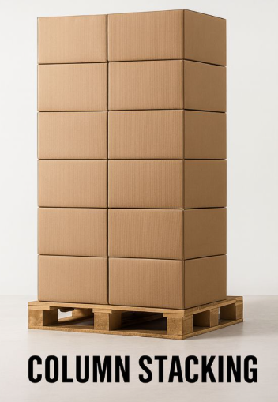

```{r setup, include=FALSE}
knitr::opts_chunk$set(
  echo = FALSE,
  warning = FALSE,
  message = FALSE
)
```

# Introducción {#introduccion} 

Bonsai Corp es una empresa de brócoli congelado, en donde los productos se comercializan en un envase primario que contiene al alimento, y estos son colocados en cajas de cartón (envase secundario) para almacenarlos y transportarlos desde 5 plantas hacia 5 regiones distribuidas por el mundo. Esta cajas son apiladas en pallets de 1200 × 800 mm y altura máxima de carga de 1800 mm. Los envíos dentro de la misma región tienen un costo de USD 150 por pallet; los envíos a las otras cuatro regiones tienen un costo de USD 500 por pallet.

El catalogo está compuesto de 427 productos, los cuales cada uno tiene su propia caja, aunque puede existir la posibilidad de que más de un producto tenga un envase secundario con iguales dimensiones. Esta estratégia de packaging durante el último período de tiempo, produjo un catalogo de 204 tipos de cajas distintos, cada uno con su propio molde, sus propias corridas de producción y su propio stock en depósito, generando altos costos de packaging, logística e inventario. Ante cada lanzamiento de un nuevo producto, estos costos siguen en aumento, y la necesidad de hacer algo para bajarlos es imperiosa.

# Objetivos

## Objetivo primario

El desafío consiste en optimizar el sistema de envases secundarios mediante la reducción de la cantidad de tipos de caja utilizados, sin comprometer la integridad del producto ni la eficiencia logística del pallet. El enfoque principal es que un mismo tipo de caja puede ser compartido por distintos productos siempre que sus dimensiones sean compatibles, lo que permite consolidar volúmenes de compra y acceder a mejores condiciones de costo. En este contexto, el objetivo es minimizar el costo total del sistema, definido como:

$$ Costo Total = C_{packaging} + C_{flete} $$
Donde:

$C_{packaging} = costo \: por \: caja * volumen \: anual$, aplicando los descuentos por volumen según el tipo de caja consolidado. Los descuentos por volumen de pedidos anual son:

- Tier 1 (< 20.000 unidades): precio base + 10%
- Tier 2 (20.000–49.999 unidades): precio base (sin descuento)
- Tier 3 (50.000–99.999 unidades): descuento del 10%
- Tier 4 (100.000–499.999 unidades): descuento del 20 %
- Tier 5 (≥ 500.000 unidades): descuento del 30 %

En cuanto al precio base por caja, se establecieron tres grosores estandarizados y homologados por Bonsai Corp, los cuales son: 3,0 mm, 4,5 mm y 5,0 mm y el precio de la caja según del grosor del cartón son: USD 0,60 para 3,0mm, USD 0,65 para 4,5mm y USD 0,70 para 5mm. La solución debe adoptar un único grosor de forma uniforme para todos los tipos de caja; no se permiten valores intermedios ni mezclas entre tipos. 

## Objetivo secundario

Como objetivo complementario, se busca analizar y cuantificar el *trade-off* entre la reducción de la cantidad de tipos de caja y la utilización del pallet. La consolidación de productos en un menor número de envases puede generar pérdidas de eficiencia logística para determinados productos al disminuir el aprovechamiento del espacio disponible en el pallet, generando mayores costos de flete. Por lo tanto, además de minimizar el costo total, la solución debe evaluar este equilibrio y proponer una alternativa que optimice simultáneamente el nivel de estandarización del packaging y la eficiencia del transporte.

## Restricciones del problema

- **Configuración interna fija:** la cantidad de envases primarios y su disposición dentro de la caja secundaria no pueden modificarse. La orientación de la caja también es fija, por lo que la dimensión de altura siempre corresponde al eje vertical del pallet.

- **Headspace máximo:** el espacio libre entre el producto y las paredes de la caja no tiene un mínimo exigido, pero sí un máximo permitido según el grosor del cartón: 6% para cajas de hasta 3,0 mm, 8% para cajas de hasta 4,5 mm y 10% para cajas de más de 4,5 mm, con un límite absoluto de 40 mm por eje.

- **Dimensiones mínimas de la caja:** las dimensiones internas actuales de cada caja representan el tamaño mínimo necesario para contener el producto y no pueden reducirse.

- **Pallet estándar:** todas las plantas utilizan un único tipo de pallet con dimensiones de 1200 × 800 mm y una altura máxima de carga de 1800 mm. La solución debe determinar cuántas cajas entran por pallet para cada tipo de caja propuesto.

- **Un solo producto por pallet:** no se permite mezclar productos distintos en un mismo pallet, aunque diferentes productos sí pueden compartir un mismo tipo de caja.

- **Método de apilado fijo:** se asume únicamente apilado por columnas (column stacking), con cajas alineadas y sin trabado, para todos los productos.

<p align="center">
  
</p>

- **Resistencia a compresión:** cada caja debe soportar la carga generada por las capas superiores del pallet. La carga máxima admisible se calcula a partir del valor de ECT (*Edge Crush Test*) correspondiente al grosor seleccionado y del perímetro de la caja.

- **Descuentos por volumen:** al establecer productos en menos tipos de caja, el volumen por tipo aumenta y se accede a mejores precios. Los descuentos deben ser suficientemente amplios para que la consolidación tenga sentido económico aun cuando implique cierta pérdida de utilización del pallet.

- **Extensibilidad del sistema:** la solución debe permitir incorporar nuevos productos en el futuro, asignándolos a una caja existente o justificando la creación de un nuevo tipo de caja.

- **Ajuste dimensional limitado:** al asignar una caja a un producto, cada dimensión interna (largo, ancho y alto) puede modificarse como máximo un 10% respecto de la dimensión original, manteniendo el volumen interno suficiente para contener el producto y respetando el headspace máximo permitido en cada eje.

# Los datos

## Bases disponibles

Fueron proporcionadas 4 bases de datos con distinta información relevante para la realización de este trabajo:

-   `catalogo_productos`

El catálogo de productos es la tabla central e incluye un identificador único por SKU, su descripción comercial, peso neto por caja y paquete y la clave que lo vincula al tipo de caja asignado. 

<details>

<summary>📂 Variables</summary>

--   `codigo_producto`

--   `descripcion_producto`

--   `ingrediente_forma`

--   `tipo_proyecto`

--   `subcategoria` 

--   `tamaño_corte` 

--   `peso_neto_caja` 

--   `tamaño_paquete` 

--  `cantidad_paquetes` 

--   `peso_neto_paquete` 

--   `caja_tipo_id`

</details>

<br>

-   `especificaciones_caja`

Las especificaciones de cajas contienen las dimensiones interiores y exteriores de cada tipo, junto con los parámetros de apilado en pallet y su utilización. 

<details>

<summary>📂 Variables</summary>

--   `caja_tipo_id` 

--   `caja_grosor_mm` 

--   `caja_interior_largo`

--   `caja_interior_ancho` 

--   `caja_interior_alto`

--   `caja_exterior_largo` 

--   `caja_exterior_ancho` 

--   `caja_exterior_alto`

--   `pallet_alto` 

--   `pallet_ancho` 

--   `pallet_largo` 

--   `cantidad_cajas_alto` 

--   `cantidad_cajas_largo` 

--   `cantidad_cajas_ancho` 

--   `cantidad_cajas_total` 

--   `utilizacion`

</details>

<br>

-   `operaciones_planta`

Las operaciones de planta registran los volúmenes anuales por SKU y los costos logísticos asociados. 

<details>

<summary>📂 Variables</summary>

--   `codigo_producto`

--   `volumen_producto_canal_servicios_comida`

--   `volumen_producto_canal_cadenas_corporativas`

--   `volumen_producto_canal_otros`

--   `volumen_producto_total` 

--   `volumen_producto_planta_buenos_aires`

--   `volumen_producto_planta_curitiba`

--   `volumen_producto_planta_santiago`

--   `volumen_producto_planta_monterrey`

--   `volumen_producto_planta_bakersfield`

--   `cantidad_pallets_planta_buenos_aires`

--   `cantidad_pallets_planta_curitiba`

--   `cantidad_pallets_planta_santiago`

--   `cantidad_pallets_planta_monterrey`

--   `cantidad_pallets_planta_bakersfield`

--   `cantidad_pallets_total`

--   `costo_total_planta_buenos_aires`

--   `costo_total_planta_curitiba`

--   `costo_total_planta_santiago`

--   `costo_total_planta_monterrey`

--   `costo_total_planta_bakersfield`

--   `costo_pallets_planta_buenos_aires`

--   `costo_pallets_planta_curitiba`

--   `costo_pallets_planta_santiago`

--   `costo_pallets_planta_monterrey`

--   `costo_pallets_planta_bakersfield`

--   `costo_pallets_total`

--   `costo_total`

</details>

<br>

-   `procurement_cajas`

El archivo de compras consolida los volúmenes por tipo de caja y planta, y define los precios unitarios resultantes de aplicar el grosor del cartón y el descuento por volumen correspondiente.

<details>

<summary>📂 Variables</summary>

--   `caja_tipo_id` 

--   `volumen_tipo_planta_buenos_aires`

--   `volumen_tipo_planta_curitiba`

--   `volumen_tipo_planta_santiago`

--   `volumen_tipo_planta_monterrey` 

--   `volumen_tipo_planta_bakersfield`

--   `costo_unitario_base`

--   `costo_total_base`

--   `costo_unitario_planta_buenos_aires`

--   `costo_unitario_planta_curitiba`

--   `costo_unitario_planta_santiago`

--   `costo_unitario_planta_monterrey`

--   `costo_unitario_planta_bakersfield`

--   `descuento_planta_buenos_aires`

--   `descuento_planta_curitiba`

--   `descuento_planta_santiago`

--   `descuento_planta_monterrey`

--   `descuento_planta_bakersfield`

--   `costo_por_pallet`

</details>

## Preprocesamiento

### Imputación de datos faltantes

### Creación de variables

# Desarrollo

## Análisis descriptivo

## Técnicas aplicadas

## Resultados

# Conclusiones y propuestas de mejoras